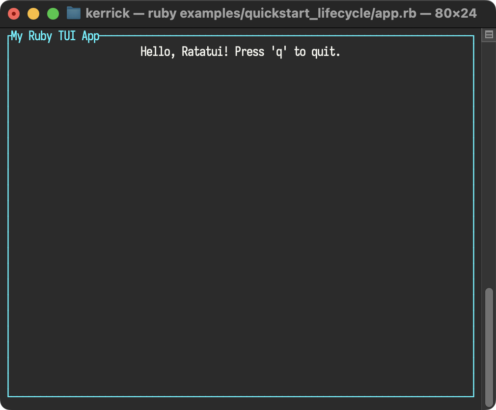
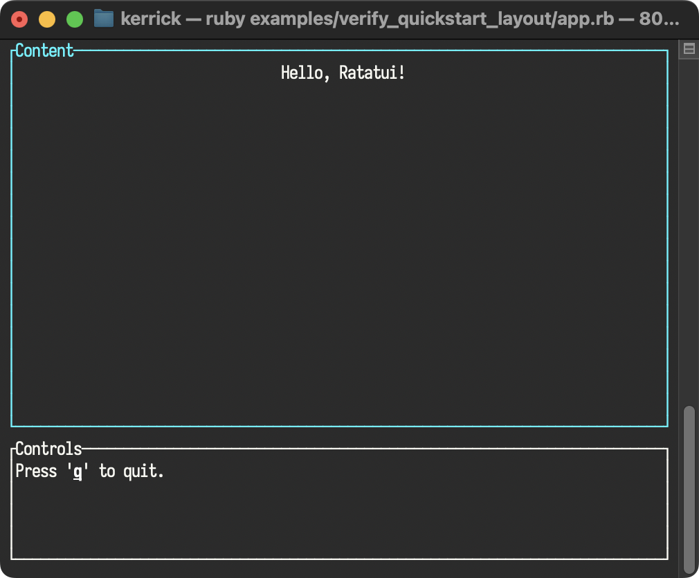

<!--
  SPDX-FileCopyrightText: 2025 Kerrick Long <me@kerricklong.com>
  SPDX-License-Identifier: CC-BY-SA-4.0
-->
# Quickstart

Welcome to **ratatui_ruby**! This guide will help you get up and running with your first Terminal User Interface in Ruby.

## Installation

See [Installation in the README](../README.md#installation) for setup instructions.


## Tutorials

### Basic Application

Here is a "Hello World" application that demonstrates the core lifecycle of a **ratatui_ruby** app.

<!-- SYNC:START:../examples/verify_quickstart_lifecycle/app.rb:main -->
```ruby
# 1. Initialize the terminal
RatatuiRuby.init_terminal

begin
  # The Main Loop
  loop do
    # 2. Create your UI (Immediate Mode)
    # We define a Paragraph widget inside a Block with a title and borders.
    view = RatatuiRuby::Widgets::Paragraph.new(
      text: "Hello, Ratatui! Press 'q' to quit.",
      alignment: :center,
      block: RatatuiRuby::Widgets::Block.new(
        title: "My Ruby TUI App",
        title_alignment: :center,
        borders: [:all],
        border_color: "cyan",
        style: { fg: "white" }
      )
    )

    # 3. Draw the UI
    RatatuiRuby.draw do |frame|
      frame.render_widget(view, frame.area)
    end

    # 4. Poll for events
    case RatatuiRuby.poll_event
    in { type: :key, code: "q" } | { type: :key, code: "c", modifiers: ["ctrl"] }
      break
    else
      nil
    end
  end
ensure
  # 5. Restore the terminal to its original state
  RatatuiRuby.restore_terminal
end
```
<!-- SYNC:END -->

[](../../examples/verify_quickstart_lifecycle/README.md)

#### How it works

1.  **`RatatuiRuby.init_terminal`**: Enters raw mode and switches to the alternate screen.
2.  **Immediate Mode UI**: On every iteration, describe your UI by creating `Data` objects (e.g., `Paragraph`, `Block`).
3.  **`RatatuiRuby.draw { |frame| ... }`**: The block receives a `Frame` object as a canvas. Render widgets onto specific areas. Nothing is drawn until the block finishes, ensuring flicker-free updates.
4.  **`RatatuiRuby.poll_event`**: Returns a typed `Event` object with predicates like `key?`, `mouse?`, `resize?`, etc. Returns `RatatuiRuby::Event::None` if no events are pending. Use predicates to check event type without pattern matching.
5.  **`RatatuiRuby.restore_terminal`**: Essential for leaving raw mode and returning to the shell. Always wrap your loop in `begin...ensure` to guarantee this runs.

### Simplified API

You can simplify your code by using `RatatuiRuby.run`. This method handles the terminal lifecycle for you, yielding a `TUI` object with factory methods for widgets.

<!-- SYNC:START:../examples/verify_quickstart_dsl/app.rb:main -->
```ruby
# 1. Initialize the terminal, start the run loop, and ensure the terminal is restored.
RatatuiRuby.run do |tui|
  loop do
    # 2. Create your UI with methods instead of classes.
    view = tui.paragraph(
      text: "Hello, Ratatui! Press 'q' to quit.",
      alignment: :center,
      block: tui.block(
        title: "My Ruby TUI App",
        title_alignment: :center,
        borders: [:all],
        border_color: "cyan",
        style: { fg: "white" }
      )
    )

    # 3. Use RatatuiRuby methods, too.
    tui.draw do |frame|
      frame.render_widget(view, frame.area)
    end

    # 4. Poll for events with pattern matching
    case tui.poll_event
    in { type: :key, code: "q" }
      break
    else
      # Ignore other events
    end
  end
end
```
<!-- SYNC:END -->

#### How it works

1.  **`RatatuiRuby.run`**: This context manager initializes the terminal before the block starts and ensures `restore_terminal` is called when the block exits (even if an error occurs).
2.  **Widget Shorthand**: The block yields a `TUI` object (here named `tui`). This object provides factory methods for every widget, allowing you to write `tui.paragraph(...)` instead of the more verbose `RatatuiRuby::Widgets::Paragraph.new(...)`.
3.  **Method Shorthand**: The `TUI` object also provides aliases for module functions of `RatatuiRuby`, allowing you to write `tui.draw(...)` instead of the more verbose `RatatuiRuby.draw(...)`.
4.  **Pattern Matching for Events**: Use `case...in` with pattern matching for elegant event dispatch. Always include an `else` clause at the end to catch unmatched event types (mouse, resize, paste, focus, etc.), otherwise Ruby raises `NoMatchingPatternError`.

For a deeper dive into the available application architectures (Manual vs Managed), see [Application Architecture](../concepts/application_architecture.md).

### Adding Layouts

Real-world applications often need to split the screen into multiple areas. `RatatuiRuby::Layout` lets you do this easily.

<!-- SYNC:START:../examples/verify_quickstart_layout/app.rb:main -->
```ruby
loop do
  tui.draw do |frame|
    # 1. Split the screen
    top, bottom = tui.layout_split(
      frame.area,
      direction: :vertical,
      constraints: [
        tui.constraint_percentage(75),
        tui.constraint_percentage(25),
      ]
    )

    # 2. Render Top Widget
    frame.render_widget(
      tui.paragraph(
        text: "Hello, Ratatui!",
        alignment: :center,
        block: tui.block(title: "Content", borders: [:all], border_color: "cyan")
      ),
      top
    )

    # 3. Render Bottom Widget with Styled Text
    # We use a Line of Spans to style specific characters
    text_line = tui.text_line(
      spans: [
        tui.text_span(content: "Press '"),
        tui.text_span(
          content: "q",
          style: tui.style(modifiers: [:bold, :underlined])
        ),
        tui.text_span(content: "' to quit."),
      ],
      alignment: :center
    )

    frame.render_widget(
      tui.paragraph(
        text: text_line,
        block: tui.block(title: "Controls", borders: [:all])
      ),
      bottom
    )
  end

  case tui.poll_event
  in { type: :key, code: "q" }
    break
  else
    # Ignore other events
  end
end
```
<!-- SYNC:END -->

#### How it works

1.  **`tui.layout_split` (`RatatuiRuby::Layout::Layout.split`)**: Takes an area (like `frame.area`) and splits it into multiple sub-areas based on constraints.
2.  **`tui.constraint_*` (`RatatuiRuby::Layout::Constraint`)**: Defines how space is distributed (e.g., `percentage`, `length`, `min`, `max`).
3.  **`Frame#render_widget(widget, rect)`**: You pass the specific area (like `top` or `bottom`) to render the widget into that exact region.
4.  **`tui.text_span` (`RatatuiRuby::Text::Span`)**: Allows for rich styling within a single line of text.

[](../../examples/verify_quickstart_layout/README.md)

## Examples

These examples showcase the full power of **ratatui_ruby**. You can find their source code in the [examples directory](../examples).

### Widget Demos

Focused examples for individual widgets. Each demonstrates a single widget and its configuration options.

| Widget | What it demonstrates |
|--------|---------------------|
| [Bar Chart](../examples/widget_barchart/app.rb) | Grouped bars, data visualization, custom bar styling |
| [Block](../examples/widget_block/app.rb) | Borders, titles, padding, nested widgets |
| [Box](../examples/widget_box/app.rb) | Block + Paragraph composition, text wrapping |
| [Calendar](../examples/widget_calendar/app.rb) | Date highlighting, month display, event markers |
| [Chart](../examples/widget_chart/app.rb) | Line/scatter plots, axes, legends, datasets |
| [Gauge](../examples/widget_gauge/app.rb) | Progress bars, percentage display, unicode blocks |
| [Layout Split](../examples/widget_layout_split/app.rb) | Constraint types, flex modes, responsive layouts |
| [Line Gauge](../examples/widget_line_gauge/app.rb) | Horizontal progress, labels, thin-style gauges |
| [List](../examples/widget_list/app.rb) | Selection, scrolling, highlight styles, rich text items |
| [Map](../examples/widget_map/app.rb) | Canvas widget, world map rendering, coordinates |
| [Popup](../examples/widget_popup/app.rb) | Clear widget, modal dialogs, overlay composition |
| [Ratatui Logo](../examples/widget_ratatui_logo/app.rb) | Decorative branding widget |
| [Ratatui Mascot](../examples/widget_ratatui_mascot/app.rb) | ASCII art Ferris mascot |
| [Rect](../examples/widget_rect/app.rb) | Geometry helpers, area calculations, contains/intersection |
| [Rich Text](../examples/widget_rich_text/app.rb) | Spans, lines, inline styling, mixed colors |
| [Scrollbar](../examples/widget_scrollbar/app.rb) | Orientations, thumb/track styling, scroll state |
| [Scroll Text](../examples/widget_scroll_text/app.rb) | Paragraph scrolling, viewport control, long content |
| [Sparkline](../examples/widget_sparkline/app.rb) | Mini charts, time series, bar sets |
| [Style Colors](../examples/widget_style_colors/app.rb) | Named colors, RGB, indexed 256-color palette |
| [Table](../examples/widget_table/app.rb) | Row selection, column widths, per-cell styling |
| [Tabs](../examples/widget_tabs/app.rb) | Tab navigation, highlighting, dividers |
| [Text Width](../examples/widget_text_width/app.rb) | Unicode-aware width measurement, CJK support |
| [Canvas](../examples/widget_canvas/app.rb) | Drawing shapes, markers, custom graphics |
| [Cell](../examples/widget_cell/app.rb) | Buffer cell inspection, styling attributes |
| [Center](../examples/widget_center/app.rb) | Centering content, horizontal/vertical alignment |
| [Overlay](../examples/widget_overlay/app.rb) | Layering widgets, modal backgrounds |
| [Custom Render](../examples/widget_render/app.rb) | Low-level Draw API, escape hatch for custom widgets |

### Sample Applications

These larger examples combine widgets into complete applications, demonstrating real-world TUI patterns and architectures.

| Application | Architecture | What you'll learn |
|-------------|--------------|-------------------|
| [All Events](../examples/app_all_events/app.rb) | Model-View-Update | Event handling, unidirectional data flow, scalable structure |
| [Color Picker](../examples/app_color_picker/app.rb) | Component-Based | Hit testing, modal dialogs, encapsulated state |
| [Login Form](../examples/app_login_form/app.rb) | Overlay + Center | Modal forms, cursor positioning, text input |
| [Stateful Interaction](../examples/app_stateful_interaction/app.rb) | State Objects | ListState/TableState, offset read-back, mouse click-to-row |

#### All Events

[](../examples/app_all_events/README.md)

#### Color Picker

[](../examples/app_color_picker/README.md)

#### Login Form

[](../examples/app_login_form/README.md)


## Next Steps

Now that you've seen what **ratatui_ruby** can do:

- **Deep dive**: Read the [Application Architecture](../concepts/application_architecture.md) guide for scaling patterns
- **Test your TUI**: See the [Testing Guide](../concepts/application_testing.md) for snapshot and style assertions
- **Explore the API**: Browse the [full RDoc documentation](../index.md)
- **Learn the philosophy**: Read [Why RatatuiRuby?](./why.md) for comparisons and design decisions
- **Get help**: Join the [discussion mailing list](https://lists.sr.ht/~kerrick/ratatui_ruby-discuss)
