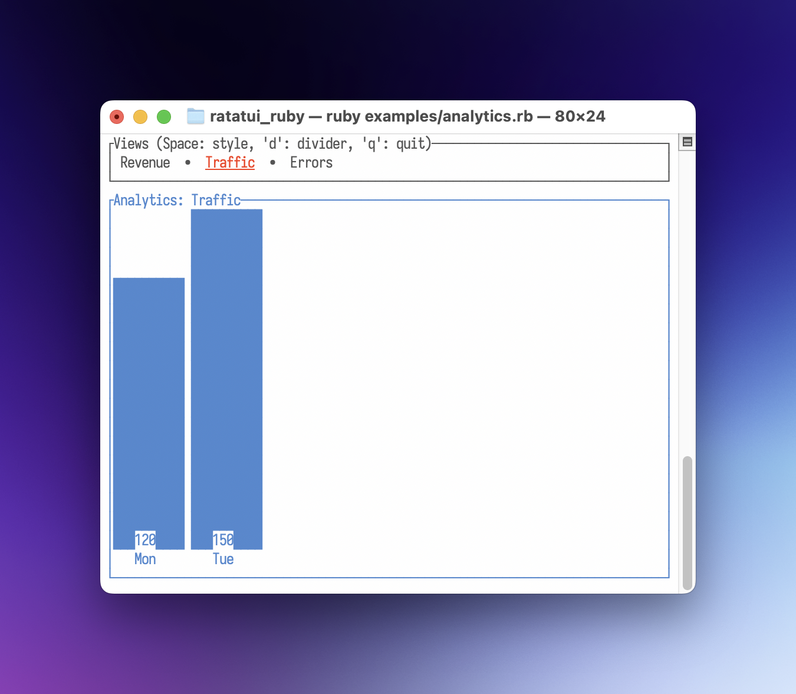
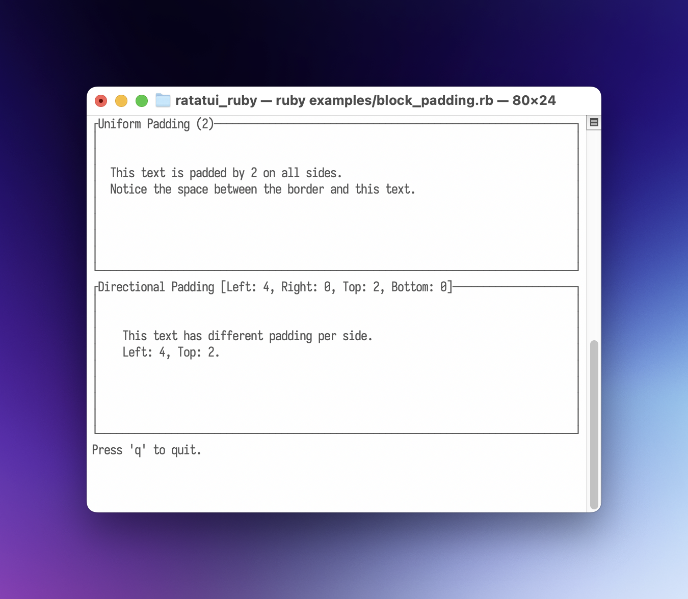
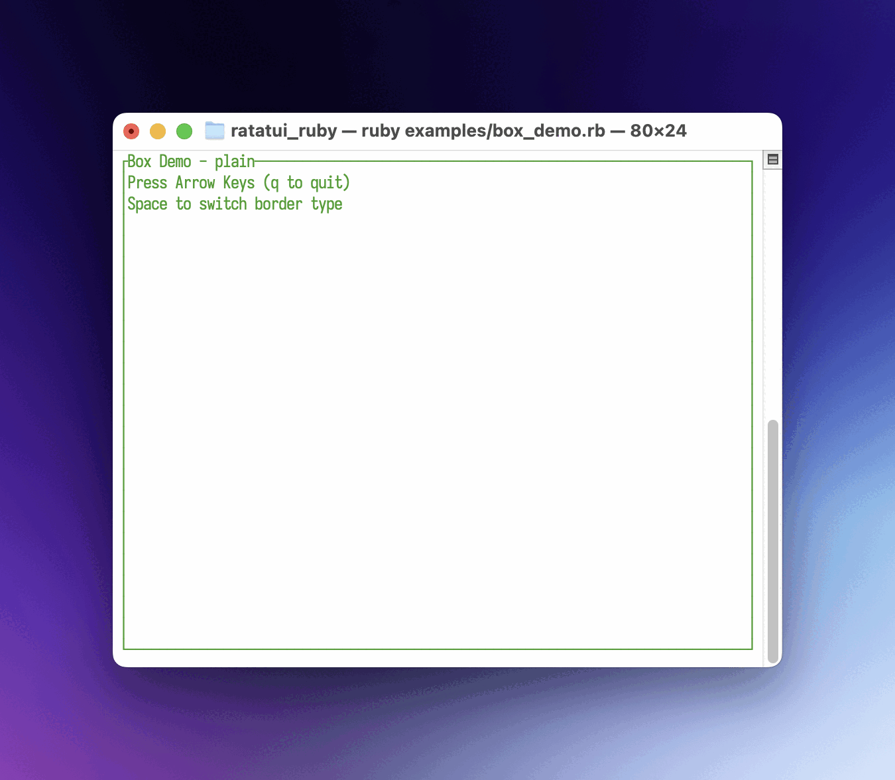
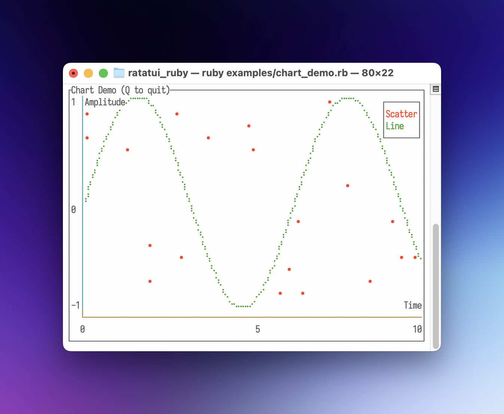
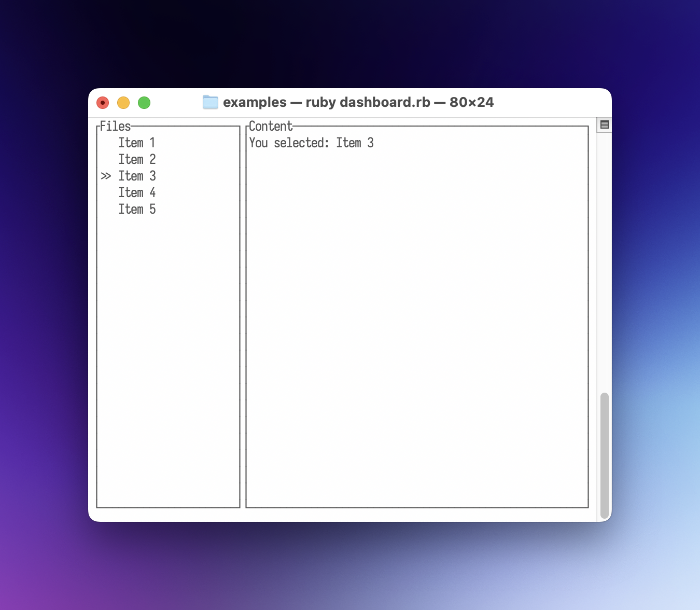
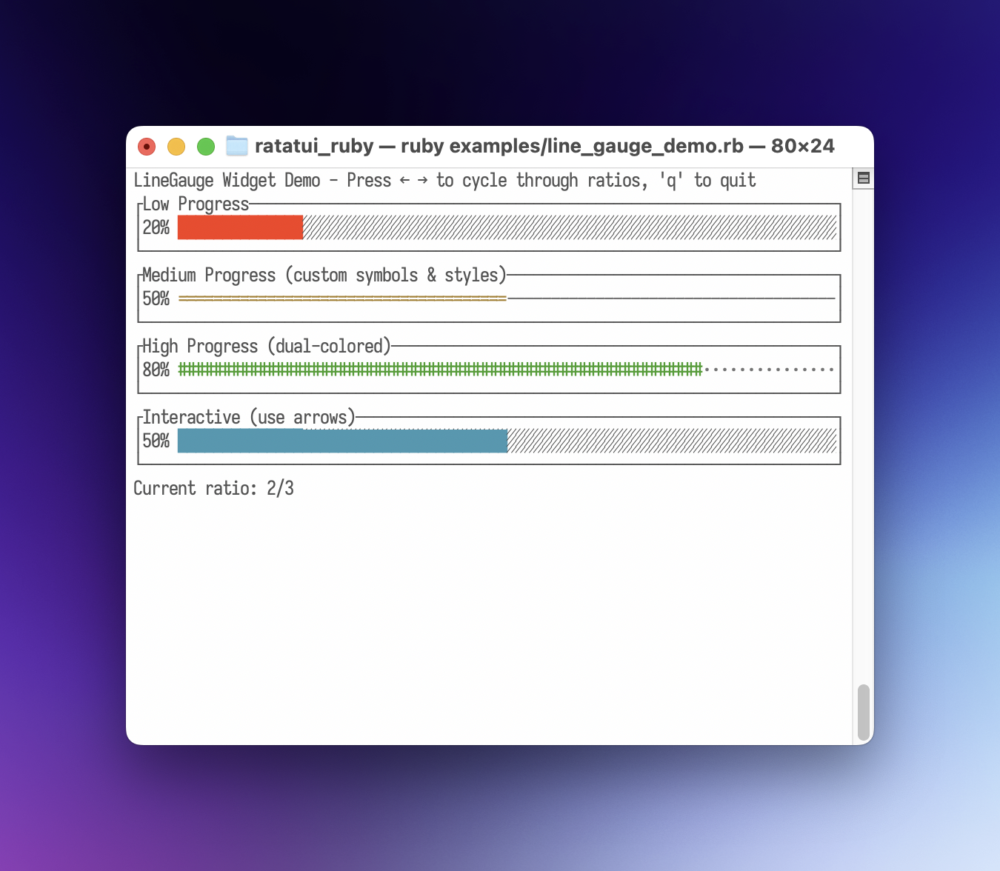
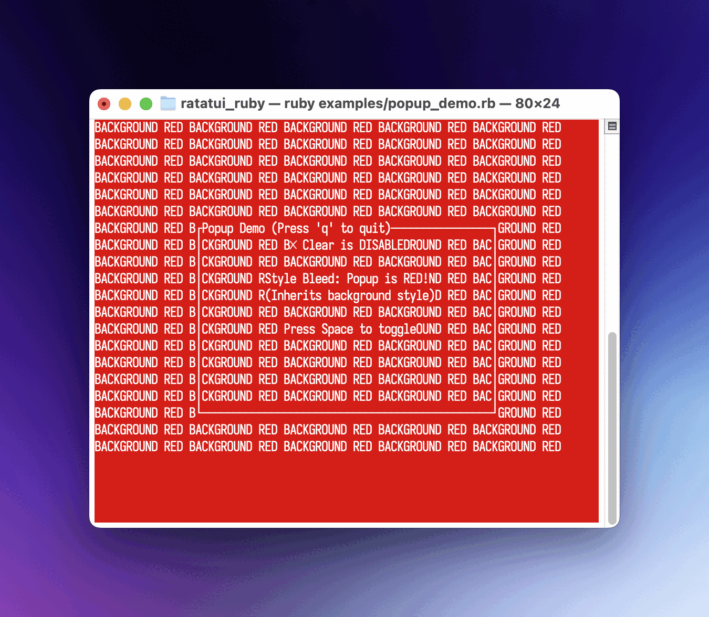
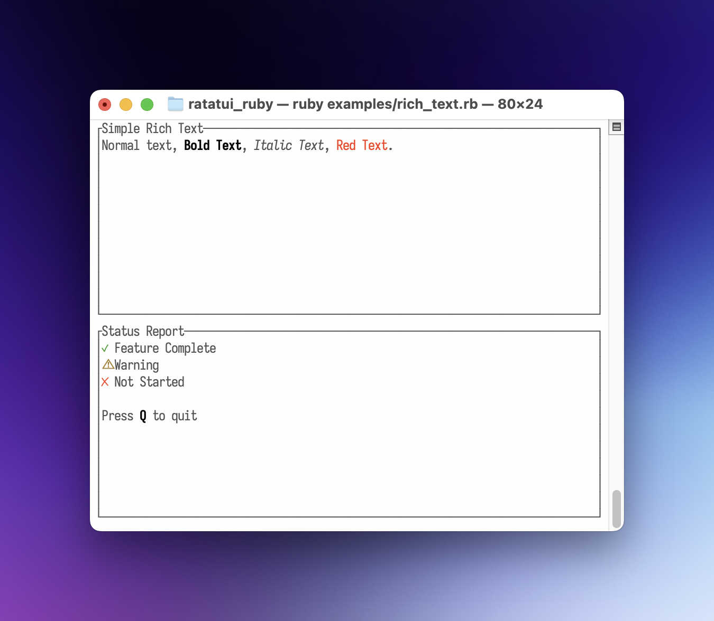
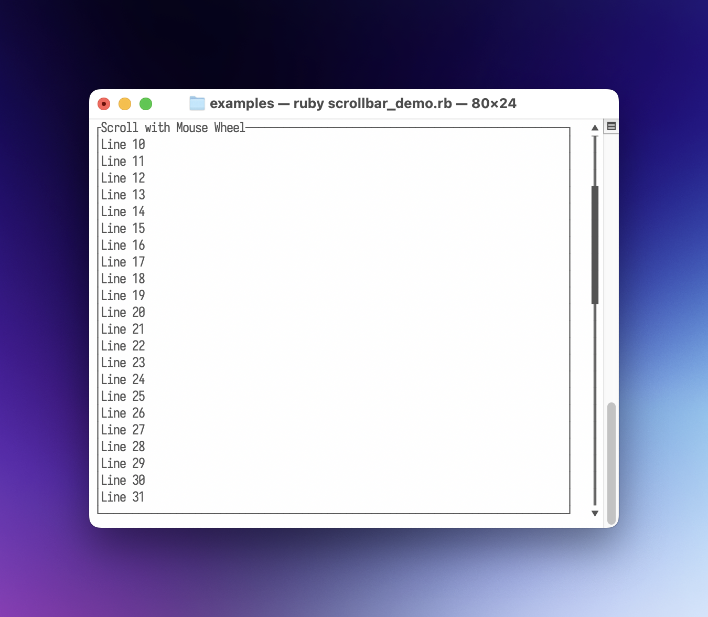
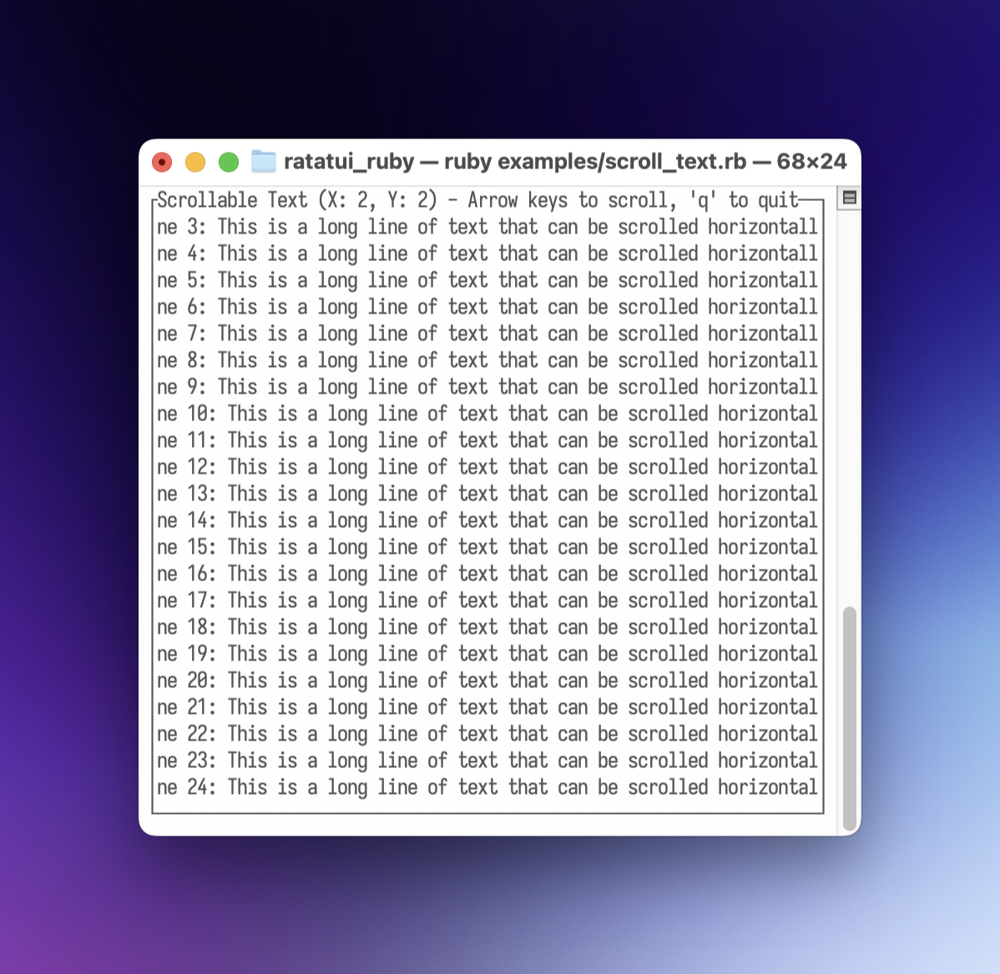

<!--
  SPDX-FileCopyrightText: 2025 Kerrick Long <me@kerricklong.com>
  SPDX-License-Identifier: CC-BY-SA-4.0
-->
# Quickstart

Welcome to **ratatui_ruby**! This guide will help you get up and running with your first Terminal User Interface in Ruby.

## Installation

Add this line to your application's Gemfile:

```ruby
gem "ratatui_ruby"
```

And then execute:

```bash
bundle install
```

Or install it yourself as:

```bash
gem install ratatui_ruby
```

## Basic Application

Here is a "Hello World" application that demonstrates the core lifecycle of a **ratatui_ruby** app.

```ruby
require "ratatui_ruby"
 
# 1. Initialize the terminal
RatatuiRuby.init_terminal
 
begin
  # The Main Loop
  loop do
    # 2. Create your UI (Immediate Mode)
    # We define a Paragraph widget inside a Block with a title and borders.
    view = RatatuiRuby::Paragraph.new(
      text: "Hello, Ratatui! Press 'q' to quit.",
      align: :center,
      block: RatatuiRuby::Block.new(
        title: "My Ruby TUI App",
        title_alignment: :center,
        borders: [:all],
        border_color: "cyan"
      )
    )
 
    # 3. Draw the UI
    RatatuiRuby.draw(view)
 
    # 4. Poll for events
    event = RatatuiRuby.poll_event
    if event && event[:type] == :key && event[:code] == "q"
      break
    end
  end
ensure
  # 5. Restore the terminal to its original state
  RatatuiRuby.restore_terminal
end
```


### How it works

1.  **`RatatuiRuby.init_terminal`**: Enters raw mode and switches to the alternate screen.
2.  **Immediate Mode UI**: On every iteration of the loop, you describe what the UI should look like by creating `Data` objects (like `Paragraph` and `Block`).
3.  **`RatatuiRuby.draw(view)`**: The Ruby UI tree is passed to the Rust backend, which renders it to the terminal.
4.  **`RatatuiRuby.poll_event`**: Checks for keyboard, mouse, or resize events.
5.  **`RatatuiRuby.restore_terminal`**: Crucial for leaving raw mode and returning the user to their shell properly. Always wrap your loop in a `begin...ensure` block to guarantee this runs.

### Idiomatic Session

You can simplify your code by using `RatatuiRuby.run`. This method handles the terminal lifecycle for you, yielding a `Session` object with factory methods for widgets.

```rb
require "ratatui_ruby"

# 1. Initialize the terminal and ensure it is restored.
RatatuiRuby.run do |tui|
  loop do
    # 2. Create your UI with methods instead of classes.
    view = tui.paragraph(
      text: "Hello, Ratatui! Press 'q' to quit.",
      align: :center,
      block: tui.block(
        title: "My Ruby TUI App",
        title_alignment: :center,
        borders: [:all],
        border_color: "cyan"
      )
    )

    # 3. Use RatatuiRuby methods, too.
    tui.draw(view)
    event = tui.poll_event
    
    if event && event[:type] == :key && event[:code] == "q"
      break
    end
  end
end
```

#### How it works

1.  **`RatatuiRuby.run`**: This context manager initializes the terminal before the block starts and ensures `restore_terminal` is called when the block exits (even if an error occurs).
2.  **Widget Shorthand**: The block yields a `Session` object (here named `tui`). This object provides factory methods for every widget, allowing you to write `tui.paragraph(...)` instead of the more verbose `RatatuiRuby::Paragraph.new(...)`.
3.  **Method Shorthand**: The session object also provides aliases for module functions of `RatatuiRuby`, allowing you to write `tui.draw(...)` instead of the more verbose `RatatuiRuby::draw(...)`.

For a deeper dive into the available application architectures (Manual vs Managed), see [Application Architecture](./application_architecture.md).

## Examples

To see more complex layouts and widget usage, check out the `examples/` directory in the repository.

### [Analytics](https://git.sr.ht/~kerrick/ratatui_ruby/tree/main/item/examples/analytics.rb)
Demonstrates the use of `Tabs` and `BarChart` widgets with a simple data-switching mechanism. Features custom highlight styles and dividers for the tabs.



### [Block Padding](https://git.sr.ht/~kerrick/ratatui_ruby/tree/main/item/examples/block_padding.rb)
Demonstrates the `padding` property of the `Block` widget, supporting both uniform and directional padding.



### [Box Demo](https://git.sr.ht/~kerrick/ratatui_ruby/tree/main/item/examples/box_demo.rb)
A simple demonstration of `Block` and `Paragraph` widgets, reacting to key presses to change colors border styles.



### [Calendar Demo](https://git.sr.ht/~kerrick/ratatui_ruby/tree/main/item/examples/calendar_demo.rb)
A simple demo application for the `Calendar` widget.


### [Chart Demo](https://git.sr.ht/~kerrick/ratatui_ruby/tree/main/item/examples/chart_demo.rb)
Demonstrates the `Chart` widget with both scatter and line datasets, including custom axes.



### [Custom Widget (Escape Hatch)](https://git.sr.ht/~kerrick/ratatui_ruby/tree/main/item/examples/custom_widget.rb)
Demonstrates how to define a custom widget in pure Ruby using the `render(area, buffer)` escape hatch for low-level drawing.


### [Dashboard](https://git.sr.ht/~kerrick/ratatui_ruby/tree/main/item/examples/dashboard.rb)
Uses `Layout`, `List`, and `Paragraph` to create a classic sidebar-and-content interface.



### [Flex Layout](https://git.sr.ht/~kerrick/ratatui_ruby/tree/main/item/examples/flex_layout.rb)
Demonstrates modern layout features including `Constraint.fill` for proportional space distribution and `flex: :space_between` for evenly distributing fixed-size elements.


### [LineGauge Demo](https://git.sr.ht/~kerrick/ratatui_ruby/tree/main/item/examples/line_gauge_demo.rb)
Demonstrates the `LineGauge` widget with customizable filled and unfilled symbols, independent styling, and interactive ratio cycling with arrow keys.



### [List Styles](https://git.sr.ht/~kerrick/ratatui_ruby/tree/main/item/examples/list_styles.rb)
Showcases advanced styling options for the `List` widget, including selection highlighting.


### [Login Form](https://git.sr.ht/~kerrick/ratatui_ruby/tree/main/item/examples/login_form.rb)
Shows how to use `Overlay`, `Center`, and `Cursor` to build a modal login form with text input.


### [Map Demo](https://git.sr.ht/~kerrick/ratatui_ruby/tree/main/item/examples/map_demo.rb)
Exhibits the `Canvas` widget's power, rendering a world map along with animated circles and lines.


### [Mouse Events](https://git.sr.ht/~kerrick/ratatui_ruby/tree/main/item/examples/mouse_events.rb)
Detailed plumbing of mouse events, including clicks, drags, and movement tracking.


### [Popup Demo](https://git.sr.ht/~kerrick/ratatui_ruby/tree/main/item/examples/popup_demo.rb)
Demonstrates the `Clear` widget and how to prevent "style bleed" when rendering opaque popups over colored backgrounds.



### [Rich Text](https://git.sr.ht/~kerrick/ratatui_ruby/tree/main/item/examples/rich_text.rb)
Demonstrates `Text::Span` and `Text::Line` for creating styled text with inline formatting, enabling word-level control over colors and text modifiers.



### [Scrollbar Demo](https://git.sr.ht/~kerrick/ratatui_ruby/tree/main/item/examples/scrollbar_demo.rb)
A simple example of integrating the `Scrollbar` widget and handling mouse wheel events for scrolling.



### [Scroll Text](https://git.sr.ht/~kerrick/ratatui_ruby/tree/main/item/examples/scroll_text.rb)
Demonstrates the `Paragraph` widget's scroll functionality, allowing navigation through long text content using arrow keys for both horizontal and vertical scrolling.



### [Stock Ticker](https://git.sr.ht/~kerrick/ratatui_ruby/tree/main/item/examples/stock_ticker.rb)
Utilizes `Sparkline` and `Chart` widgets to visualize real-time (simulated) data.


### [System Monitor](https://git.sr.ht/~kerrick/ratatui_ruby/tree/main/item/examples/system_monitor.rb)
Combines `Table` and `Gauge` widgets in a vertical layout to create a functional system overview.


### [Table Select](https://git.sr.ht/~kerrick/ratatui_ruby/tree/main/item/examples/table_select.rb)
Demonstrates interactive row selection in the `Table` widget with keyboard navigation, highlighting selected rows with custom styles and symbols.


