<!--
  SPDX-FileCopyrightText: 2025 Kerrick Long <me@kerricklong.com>
  SPDX-License-Identifier: CC-BY-SA-4.0
-->
# Quickstart

Welcome to **ratatui_ruby**! This guide will help you get up and running with your first Terminal User Interface in Ruby.

## Installation

Add this line to your application's Gemfile:

```ruby
gem "ratatui_ruby"
```


And then execute:

```bash
bundle install
```


Or install it yourself as:

```bash
gem install ratatui_ruby
```


## Tutorials

### Basic Application

Here is a "Hello World" application that demonstrates the core lifecycle of a **ratatui_ruby** app.

```ruby
require "ratatui_ruby"
 
# 1. Initialize the terminal
RatatuiRuby.init_terminal
 
begin
  # The Main Loop
  loop do
    # 2. Create your UI (Immediate Mode)
    # We define a Paragraph widget inside a Block with a title and borders.
    view = RatatuiRuby::Paragraph.new(
      text: "Hello, Ratatui! Press 'q' to quit.",
      alignment: :center,
      block: RatatuiRuby::Block.new(
        title: "My Ruby TUI App",
        title_alignment: :center,
        borders: [:all],
        border_color: "cyan",
        style: { fg: "white" }
      )
    )
 
    # 3. Draw the UI
    RatatuiRuby.draw do |frame|
      frame.render_widget(view, frame.area)
    end
 
    # 4. Poll for events
    event = RatatuiRuby.poll_event
    break if event.key? && event.code == "q"
  end
ensure
  # 5. Restore the terminal to its original state
  RatatuiRuby.restore_terminal
end
```


#### How it works

1.  **`RatatuiRuby.init_terminal`**: Enters raw mode and switches to the alternate screen.
2.  **Immediate Mode UI**: On every iteration, describe your UI by creating `Data` objects (e.g., `Paragraph`, `Block`).
3.  **`RatatuiRuby.draw { |frame| ... }`**: The block receives a `Frame` object as a canvas. Render widgets onto specific areas. Nothing is drawn until the block finishes, ensuring flicker-free updates.
4.  **`RatatuiRuby.poll_event`**: Returns a typed `Event` object with predicates like `key?`, `mouse?`, `resize?`, etc. Returns `RatatuiRuby::Event::None` if no events are pending. Use predicates to check event type without pattern matching.
5.  **`RatatuiRuby.restore_terminal`**: Essential for leaving raw mode and returning to the shell. Always wrap your loop in `begin...ensure` to guarantee this runs.

### Idiomatic Session

You can simplify your code by using `RatatuiRuby.run`. This method handles the terminal lifecycle for you, yielding a `Session` object with factory methods for widgets.

```rb
require "ratatui_ruby"

# 1. Initialize the terminal and ensure it is restored.
RatatuiRuby.run do |tui|
  loop do
    # 2. Create your UI with methods instead of classes.
    view = tui.paragraph(
      text: "Hello, Ratatui! Press 'q' to quit.",
      alignment: :center,
      block: tui.block(
        title: "My Ruby TUI App",
        title_alignment: :center,
        borders: [:all],
        border_color: "cyan",
        style: { fg: "white" }
      )
    )

    # 3. Use RatatuiRuby methods, too.
    tui.draw do |frame|
      frame.render_widget(view, frame.area)
    end

    # 4. Poll for events with pattern matching
    case tui.poll_event
    in { type: :key, code: "q" }
      break
    else
      # Ignore other events
    end
  end
end
```

#### How it works

1.  **`RatatuiRuby.run`**: This context manager initializes the terminal before the block starts and ensures `restore_terminal` is called when the block exits (even if an error occurs).
2.  **Widget Shorthand**: The block yields a `Session` object (here named `tui`). This object provides factory methods for every widget, allowing you to write `tui.paragraph(...)` instead of the more verbose `RatatuiRuby::Paragraph.new(...)`.
3.  **Method Shorthand**: The session object also provides aliases for module functions of `RatatuiRuby`, allowing you to write `tui.draw(...)` instead of the more verbose `RatatuiRuby.draw(...)`.
4.  **Pattern Matching for Events**: Use `case...in` with pattern matching for elegant event dispatch. Always include an `else` clause at the end to catch unmatched event types (mouse, resize, paste, focus, etc.), otherwise Ruby raises `NoMatchingPatternError`.

For a deeper dive into the available application architectures (Manual vs Managed), see [Application Architecture](./application_architecture.md).

### Adding Layouts

Real-world applications often need to split the screen into multiple areas. `RatatuiRuby::Layout` lets you do this easily.

```ruby
require "ratatui_ruby"

RatatuiRuby.run do |tui|
  loop do
    tui.draw do |frame|
      # 1. Split the screen
      top, bottom = tui.layout_split(
        frame.area,
        direction: :vertical,
        constraints: [
          tui.constraint_percentage(75),
          tui.constraint_percentage(25),
        ]
      )

      # 2. Render Top Widget
      frame.render_widget(
        tui.paragraph(
          text: "Hello, Ratatui!",
          alignment: :center,
          block: tui.block(title: "Content", borders: [:all], border_color: "cyan")
        ),
        top
      )

      # 3. Render Bottom Widget with Styled Text
      # We use a Line of Spans to style specific characters
      text_line = tui.text_line(
        spans: [
          tui.text_span(content: "Press '"),
          tui.text_span(
            content: "q",
            style: tui.style(modifiers: [:bold, :underlined])
          ),
          tui.text_span(content: "' to quit."),
        ],
        alignment: :center
      )

      frame.render_widget(
        tui.paragraph(
          text: text_line,
          block: tui.block(title: "Controls", borders: [:all])
        ),
        bottom
      )
    end

    case tui.poll_event
    in { type: :key, code: "q" }
      break
    else
      # Ignore other events
    end
  end
end
```

#### How it works

1.  **`tui.layout_split` (`RatatuiRuby::Layout.split`)**: Takes an area (like `frame.area`) and splits it into multiple sub-areas based on constraints.
2.  **`tui.constraint_*` (`RatatuiRuby::Constraint`)**: Defines how space is distributed (e.g., `percentage`, `length`, `min`, `max`).
3.  **`Frame#render_widget(widget, rect)`**: You pass the specific area (like `top` or `bottom`) to render the widget into that exact region.
4.  **`tui.text_span` (`RatatuiRuby::Text::Span`)**: Allows for rich styling within a single line of text.

## Examples

These examples showcase the full power of **ratatui_ruby**. You can find their source code in the [examples directory](../examples).

### Sample Applications

Full-featured examples demonstrating complex layouts and real-world TUI patterns.

#### [Analytics](https://git.sr.ht/~kerrick/ratatui_ruby/tree/main/item/examples/app_analytics/app.rb)

Demonstrates the use of `Tabs` and `BarChart` widgets. Features custom highlight styles, base styles, dividers for the tabs, and dynamic width calculation. The `BarChart` showcases both standard and grouped bars (Quarterly view), highlighting features like `group_gap` spacing, toggling `BarChart::direction`, customizing label/value styles, cycling custom `BarChart::bar_set` characters, and switching between Full and Mini height modes.


#### [All Events](https://git.sr.ht/~kerrick/ratatui_ruby/tree/main/item/examples/app_all_events/app.rb)

A comprehensive demonstration of every event type supported by **ratatui_ruby**: Key, Mouse, Resize, Paste, and Focus events.

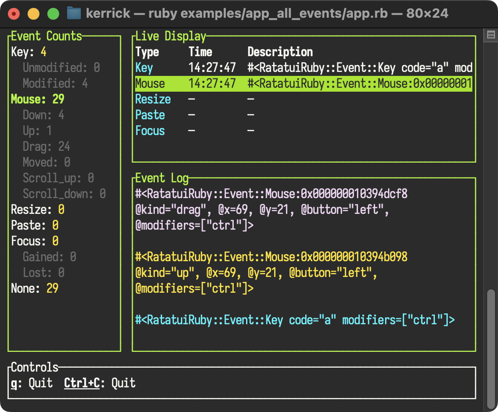

#### [Custom Widget (Escape Hatch)](https://git.sr.ht/~kerrick/ratatui_ruby/tree/main/item/examples/app_custom_widget/app.rb)

Demonstrates how to define a custom widget in pure Ruby using the `render(area, buffer)` escape hatch for low-level drawing.

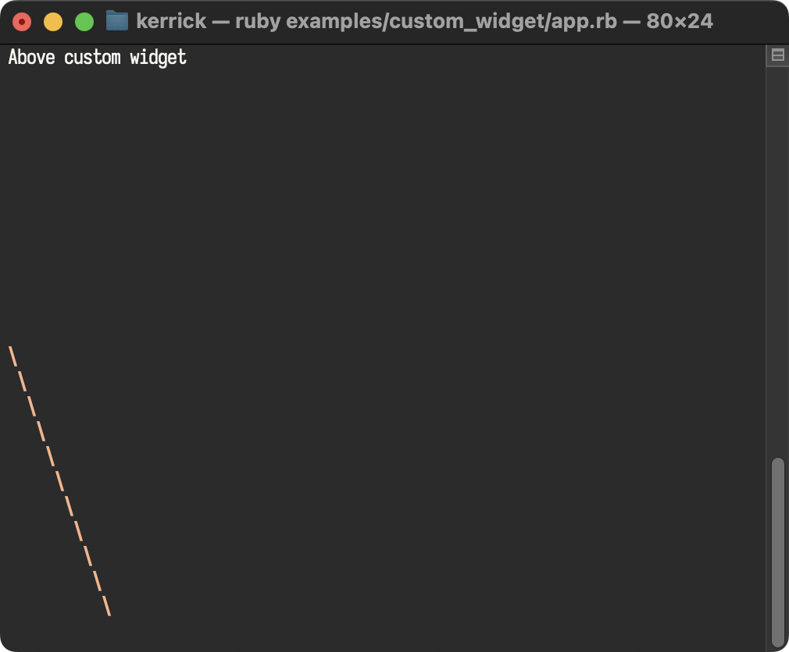

#### [Flex Layout](https://git.sr.ht/~kerrick/ratatui_ruby/tree/main/item/examples/app_flex_layout/app.rb)

Demonstrates modern layout features including `Constraint.fill` and `Constraint.ratio` for proportional space distribution and `flex: :space_between` for evenly distributing fixed-size elements.

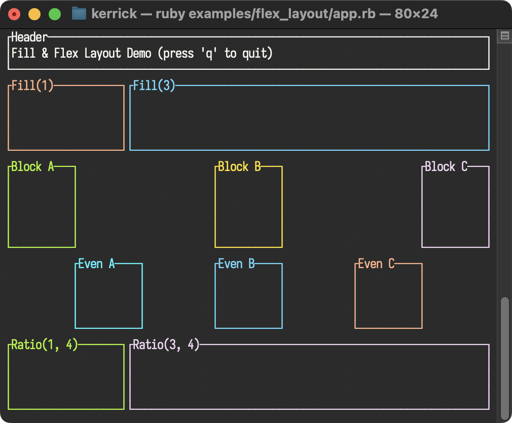

#### [Login Form](https://git.sr.ht/~kerrick/ratatui_ruby/tree/main/item/examples/app_login_form/app.rb)

Shows how to use `Overlay`, `Center`, and `Cursor` to build a modal login form with text input.


#### [Map Demo](https://git.sr.ht/~kerrick/ratatui_ruby/tree/main/item/examples/app_map_demo/app.rb)

Exhibits the `Canvas` widget's power, rendering a world map with city labels, animated circles, and lines.


#### [Mouse Events](https://git.sr.ht/~kerrick/ratatui_ruby/tree/main/item/examples/app_mouse_events/app.rb)

Detailed plumbing of mouse events, including clicks, drags, and movement tracking.

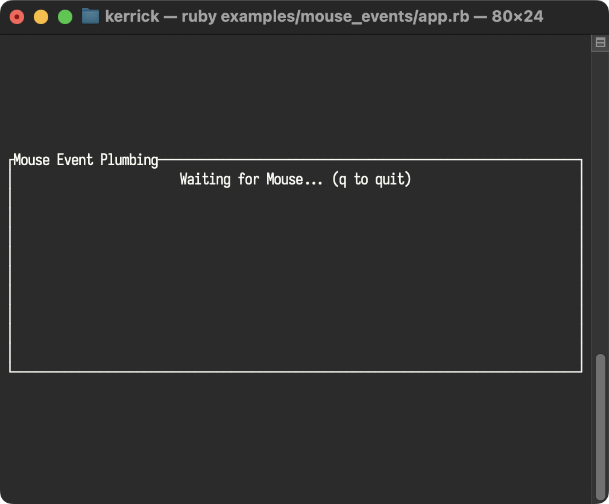

#### [Table Select](https://git.sr.ht/~kerrick/ratatui_ruby/tree/main/item/examples/app_table_select/app.rb)

Demonstrates interactive row selection in the `Table` widget with keyboard navigation, highlighting selected rows with custom styles and symbols, applying a base style, and dynamically adjusting `column_spacing`. Also demonstrates `column_highlight_style` and the new `cell_highlight_style` for precise selection visualization.


### Widget Demos

Single-widget examples that exhaustively demonstrate a widget's configuration options.

#### [Block Padding](https://git.sr.ht/~kerrick/ratatui_ruby/tree/main/item/examples/widget_block_padding/app.rb)

Demonstrates the `padding` property of the `Block` widget, supporting both uniform and directional padding.

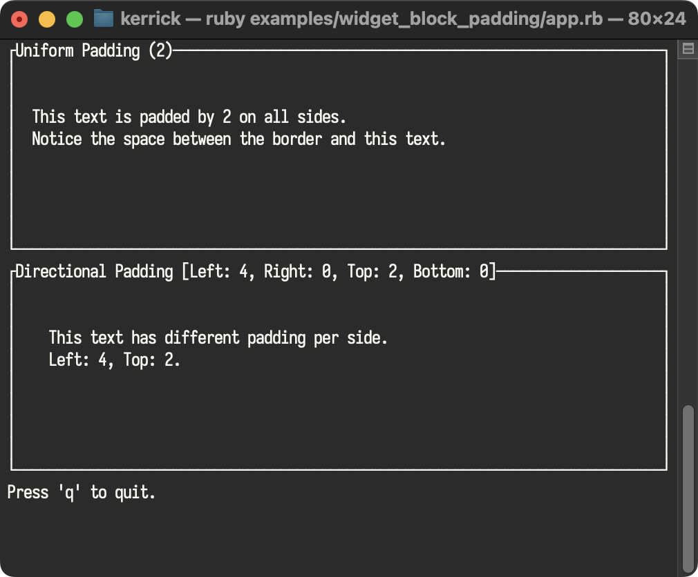

#### [Block Titles](https://git.sr.ht/~kerrick/ratatui_ruby/tree/main/item/examples/widget_block_titles/app.rb)

Demonstrates the `Block` widget's ability to render multiple titles with individual alignment and positioning (top/bottom).

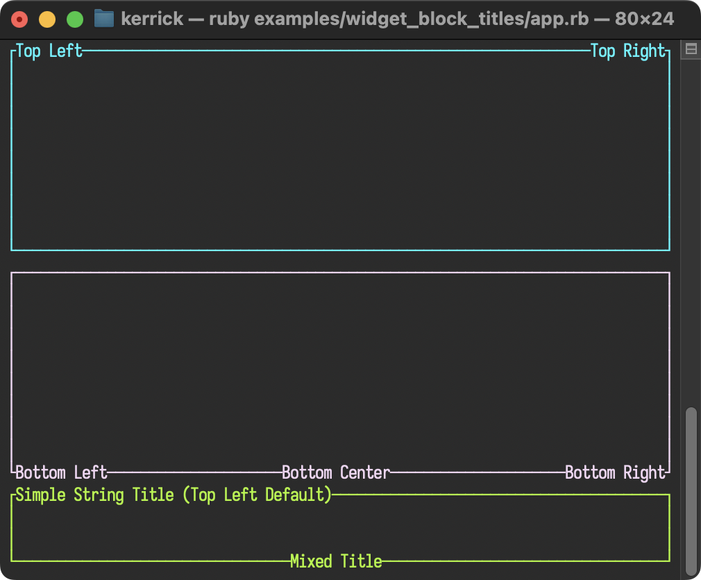

#### [Box Demo](https://git.sr.ht/~kerrick/ratatui_ruby/tree/main/item/examples/widget_box_demo/app.rb)

A simple demonstration of `Block` and `Paragraph` widgets, reacting to key presses to change colors, border types, border styles, and title styling. Features the new `border_style` parameter for applying colors and modifiers (bold, italic) to borders independently of the content background.


#### [Calendar Demo](https://git.sr.ht/~kerrick/ratatui_ruby/tree/main/item/examples/widget_calendar_demo/app.rb)

Demonstrates the `Calendar` widget with interactive attribute cycling. Features event highlighting (dates with specific styles), toggleable month/weekday headers, and surrounding month visibility (with custom styling) via keyboard shortcuts. Press `h` to toggle month header, `w` to toggle weekday header, `s` to toggle surrounding month dates, and `e` to toggle events.


#### [Chart Demo](https://git.sr.ht/~kerrick/ratatui_ruby/tree/main/item/examples/widget_chart_demo/app.rb)

Demonstrates the `Chart` widget with both scatter and line datasets, including custom axes. Features customizable axis label alignment and legend positioning.

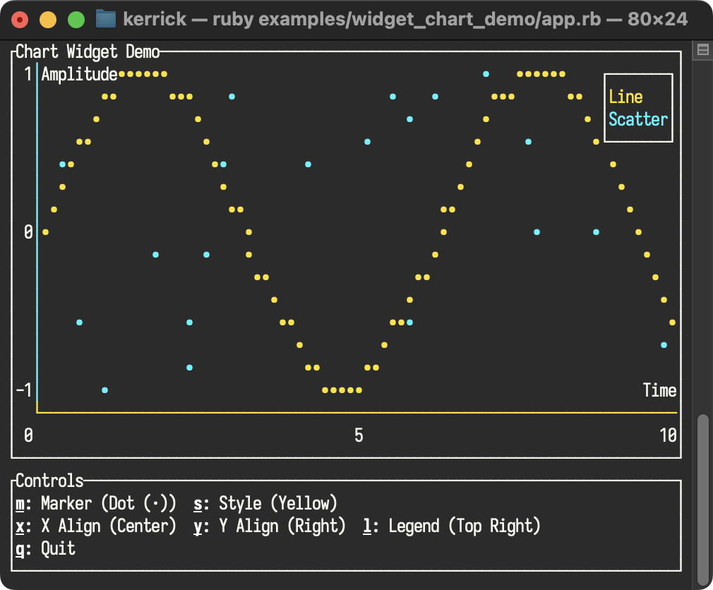

#### [Gauge Demo](https://git.sr.ht/~kerrick/ratatui_ruby/tree/main/item/examples/widget_gauge_demo/app.rb)

Demonstrates the `Gauge` widget with interactive attribute cycling. Features multiple gauge instances with customizable ratio, gauge color, background style, Unicode toggle, and label modes. The sidebar provides hotkey documentation for exploring all Gauge options, including the distinction between `style` (background) and `gauge_style` (filled bar).

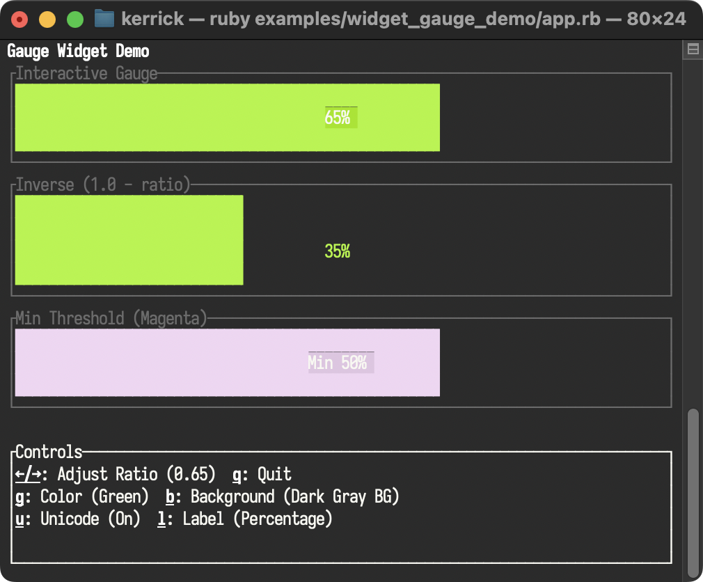

#### [LineGauge Demo](https://git.sr.ht/~kerrick/ratatui_ruby/tree/main/item/examples/widget_line_gauge_demo/app.rb)

Demonstrates the `LineGauge` widget with customizable filled and unfilled symbols, base style support via the `style` parameter, independent styling for filled/unfilled portions, and interactive ratio cycling with arrow keys.

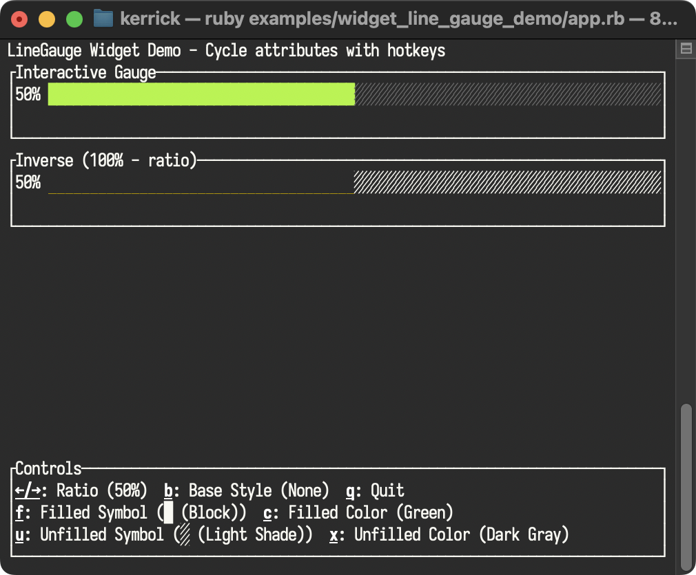

#### [List Demo](https://git.sr.ht/~kerrick/ratatui_ruby/tree/main/item/examples/widget_list_demo/app.rb)

Demonstrates the `List` widget with interactive attribute cycling. Features multiple item sets to browse, customizable highlight styles and symbols, and exploration of all List options including direction, highlight spacing, repeat symbol mode, scroll padding, and base styling. The sidebar provides hotkey documentation for discovering all List features, including the new `p` key to adjust scroll padding.

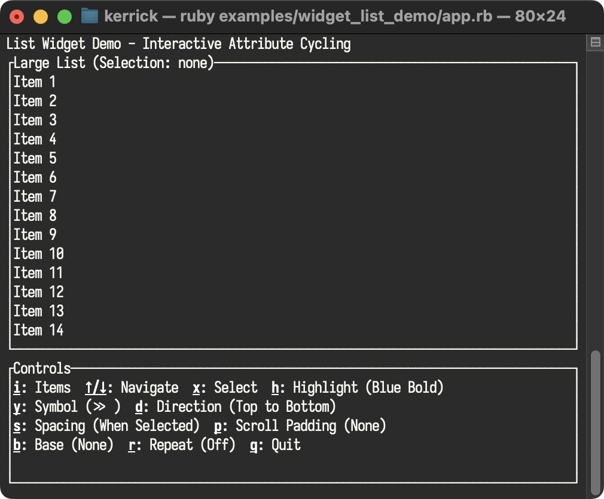

#### [Popup Demo](https://git.sr.ht/~kerrick/ratatui_ruby/tree/main/item/examples/widget_popup_demo/app.rb)

Demonstrates the `Clear` widget and how to prevent "style bleed" when rendering opaque popups over colored backgrounds.


#### [Ratatui Logo Demo](https://git.sr.ht/~kerrick/ratatui_ruby/tree/main/item/examples/widget_ratatui_logo_demo/app.rb)

Demonstrates the `RatatuiLogo` widget.

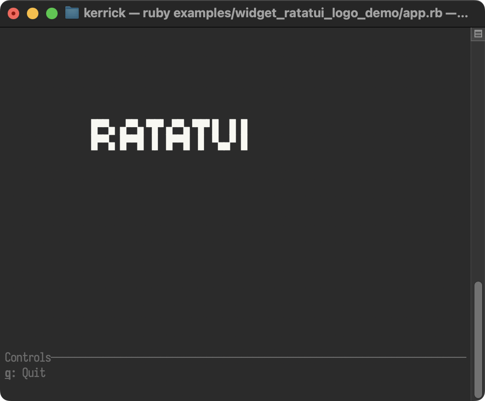

#### [Rich Text](https://git.sr.ht/~kerrick/ratatui_ruby/tree/main/item/examples/widget_rich_text/app.rb)

Demonstrates `Text::Span` and `Text::Line` for creating styled text with inline formatting, enabling word-level control over colors and text modifiers.

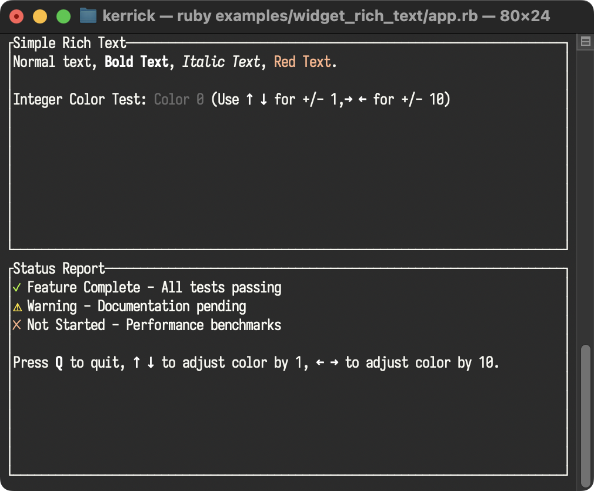

#### [Scrollbar Demo](https://git.sr.ht/~kerrick/ratatui_ruby/tree/main/item/examples/widget_scrollbar_demo/app.rb)

A demonstration of the `Scrollbar` widget, featuring mouse wheel scrolling and extensive customization of symbols and styles.


#### [Scroll Text](https://git.sr.ht/~kerrick/ratatui_ruby/tree/main/item/examples/widget_scroll_text/app.rb)

Demonstrates the `Paragraph` widget's scroll functionality, allowing navigation through long text content using arrow keys for both horizontal and vertical scrolling.

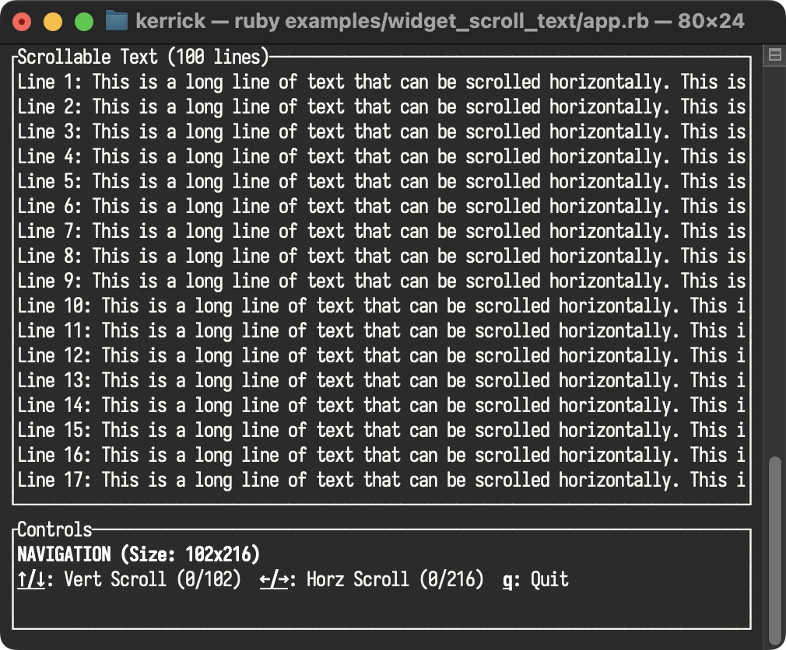

#### [Sparkline Demo](https://git.sr.ht/~kerrick/ratatui_ruby/tree/main/item/examples/widget_sparkline_demo/app.rb)

Demonstrates the `Sparkline` widget with interactive attribute cycling. Features multiple data sets with different patterns (steady growth, gaps, random, sawtooth, peaks), and explores all `Sparkline` options including direction, color, the new `absent_value_symbol` and `absent_value_style` parameters for distinguishing zero/absent values from low data, and the new `bar_set` parameter for custom bar characters.

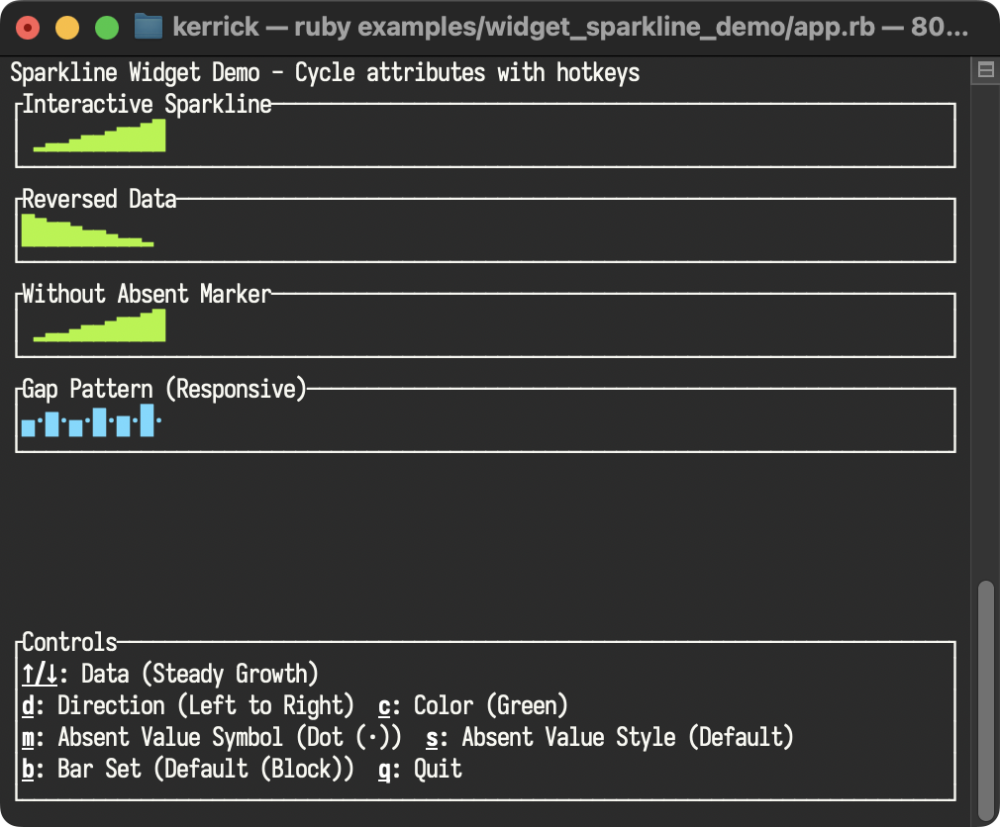

#### [Table Flex](https://git.sr.ht/~kerrick/ratatui_ruby/tree/main/item/examples/widget_table_flex/app.rb)

Demonstrates different flex modes in the `Table` widget, such as `:space_between` and `:space_around`, allowing for modern, responsive table layouts.

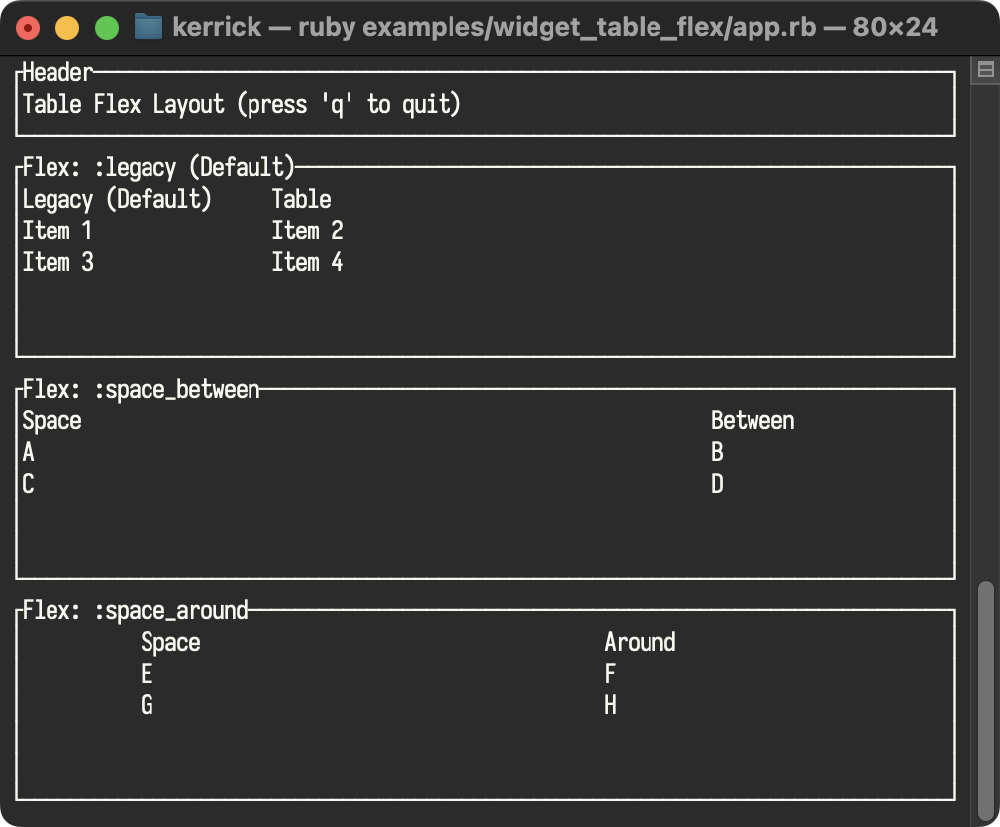

#### [Widget Style Colors](https://git.sr.ht/~kerrick/ratatui_ruby/tree/main/item/examples/widget_style_colors/app.rb)

Demonstrates hexadecimal color code support in Style parameters. Renders an 80x24 color gradient using HSL-to-RGB conversion and #RRGGBB hex codes, showcasing 24-bit true color rendering on capable terminals.

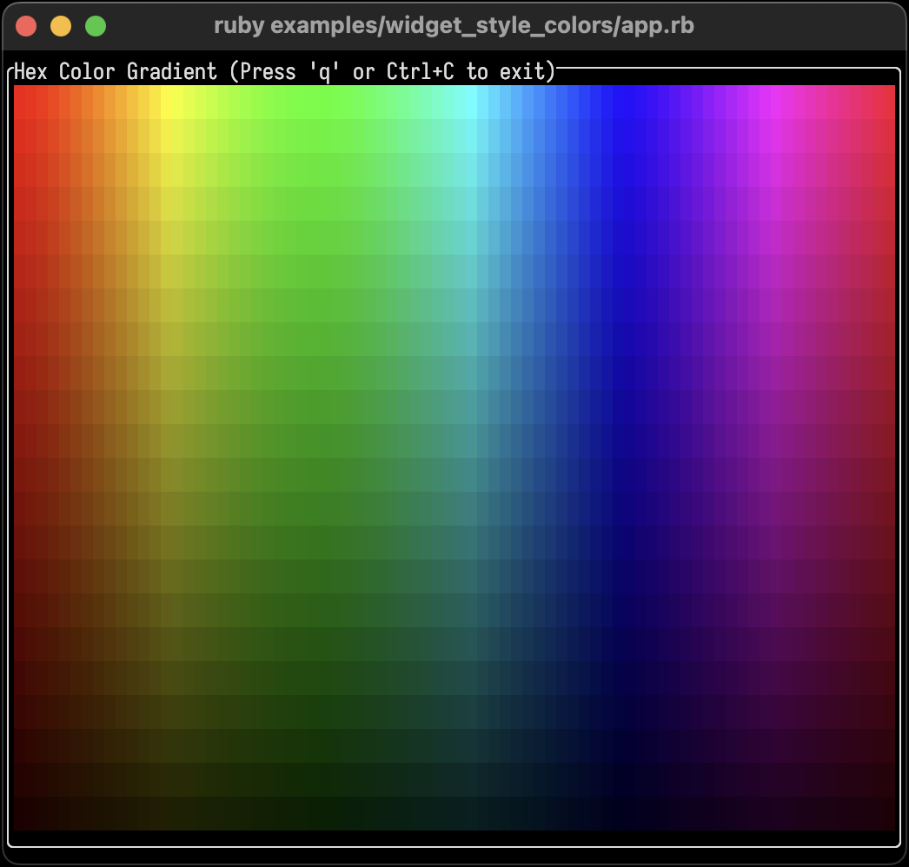
