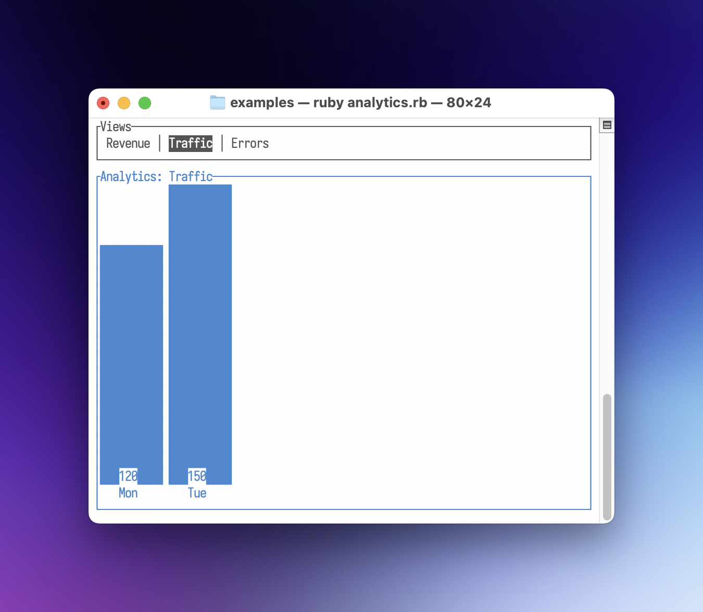
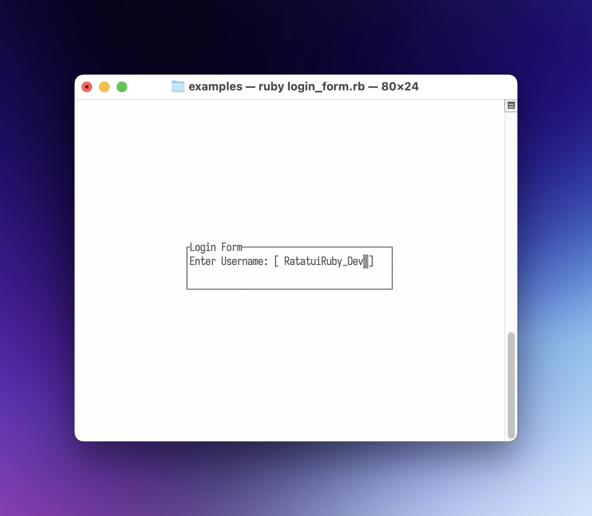
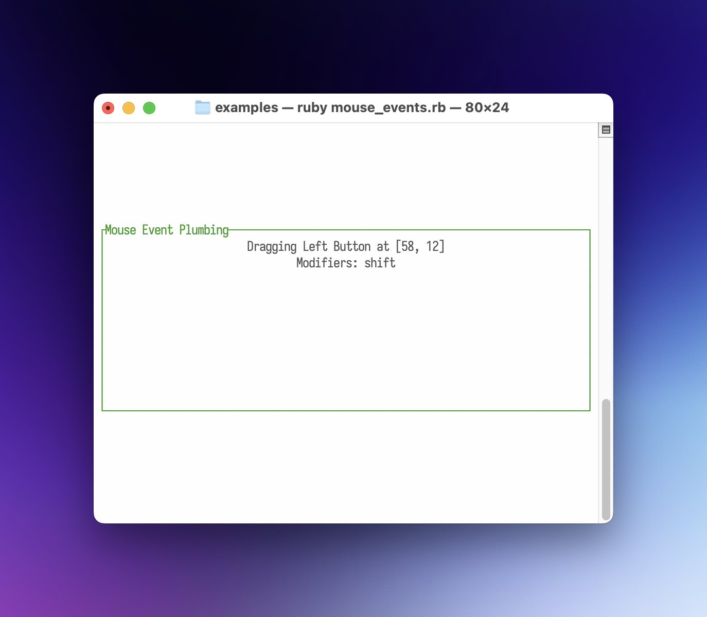
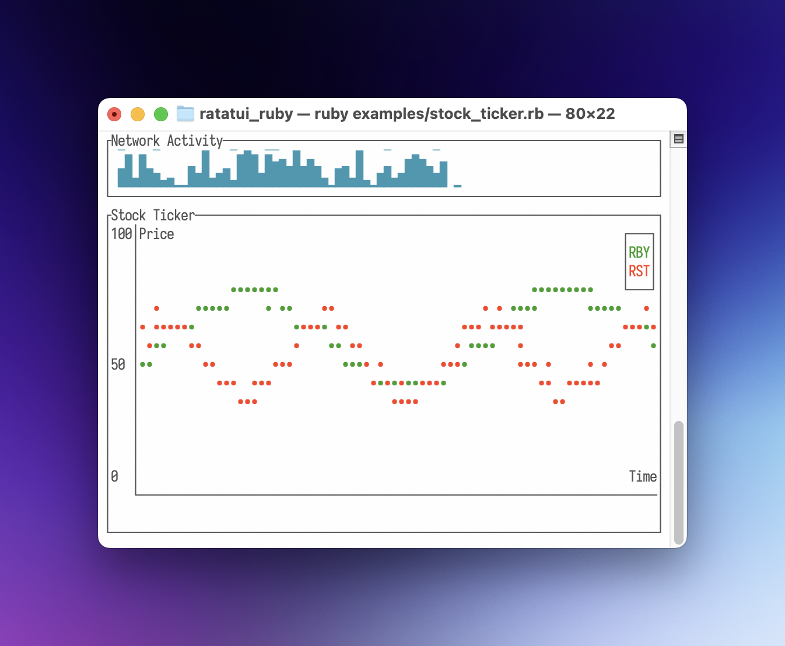
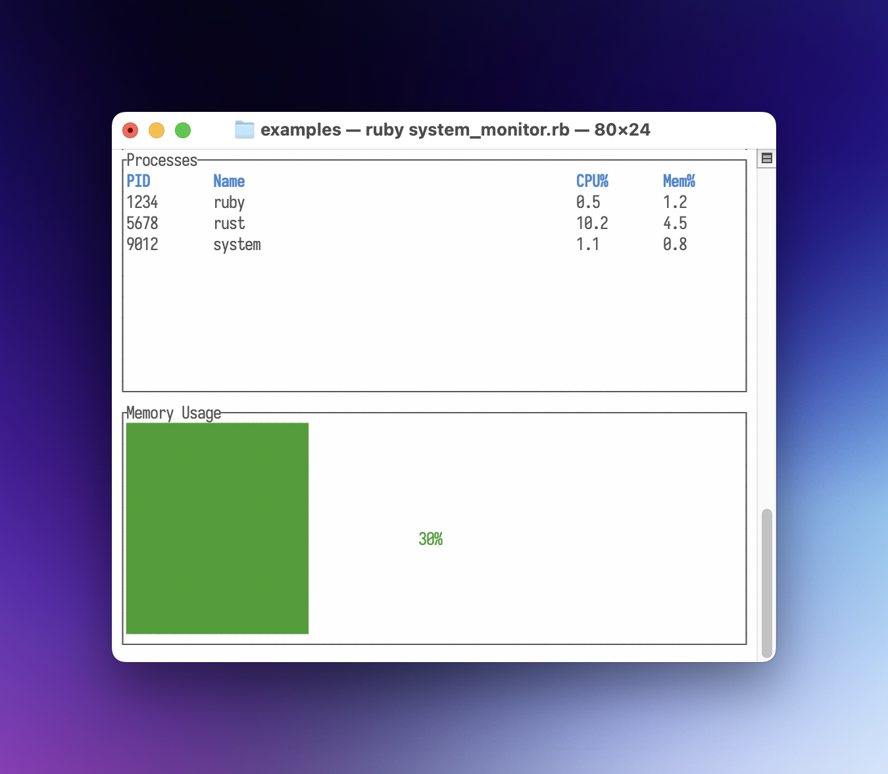

<!--
  SPDX-FileCopyrightText: 2025 Kerrick Long <me@kerricklong.com>
  SPDX-License-Identifier: CC-BY-SA-4.0
-->
# Quickstart

Welcome to **ratatui_ruby**! This guide will help you get up and running with your first Terminal User Interface in Ruby.

## Installation

Add this line to your application's Gemfile:

```ruby
gem 'ratatui_ruby'
```

And then execute:

```bash
bundle install
```

Or install it yourself as:

```bash
gem install ratatui_ruby
```

## Basic Application

Here is a "Hello World" application that demonstrates the core lifecycle of a **ratatui_ruby** app.

```ruby
require "ratatui_ruby"
 
# 1. Initialize the terminal
RatatuiRuby.init_terminal
 
begin
  # The Main Loop
  loop do
    # 2. Create your UI (Immediate Mode)
    # We define a Paragraph widget inside a Block with a title and borders.
    view = RatatuiRuby::Paragraph.new(
      text: "Hello, Ratatui! Press 'q' to quit.",
      block: RatatuiRuby::Block.new(
        title: "My First App",
        borders: [:all],
        border_color: "cyan"
      ),
      align: :center
    )
 
    # 3. Draw the UI
    RatatuiRuby.draw(view)
 
    # 4. Poll for events
    event = RatatuiRuby.poll_event
    if event && event[:type] == :key && event[:code] == "q"
      break
    end
  end
ensure
  # 5. Restore the terminal to its original state
  RatatuiRuby.restore_terminal
end
 
# This sample application was created by AI. https://declare-ai.org/1.0.0/total.html
```

### How it works

1.  **`RatatuiRuby.init_terminal`**: Enters raw mode and switches to the alternate screen.
2.  **Immediate Mode UI**: On every iteration of the loop, you describe what the UI should look like by creating `Data` objects (like `Paragraph` and `Block`).
3.  **`RatatuiRuby.draw(view)`**: The Ruby UI tree is passed to the Rust backend, which renders it to the terminal.
4.  **`RatatuiRuby.poll_event`**: Checks for keyboard, mouse, or resize events.
5.  **`RatatuiRuby.restore_terminal`**: Crucial for leaving raw mode and returning the user to their shell properly. Always wrap your loop in a `begin...ensure` block to guarantee this runs.
6.  **`sleep 0.05`**: In a real app, you'd want to control your frame rate to avoid consuming 100% CPU.

## Examples

To see more complex layouts and widget usage, check out the `examples/` directory in the repository.

### [Analytics](https://git.sr.ht/~kerrick/ratatui_ruby/tree/main/item/examples/analytics.rb)
Demonstrates the use of `Tabs` and `BarChart` widgets with a simple data-switching mechanism.



### [Box Demo](https://git.sr.ht/~kerrick/ratatui_ruby/tree/main/item/examples/box_demo.rb)
A simple demonstration of `Block` and `Paragraph` widgets, reacting to arrow key presses to change colors.


### [Dashboard](https://git.sr.ht/~kerrick/ratatui_ruby/tree/main/item/examples/dashboard.rb)
Uses `Layout`, `List`, and `Paragraph` to create a classic sidebar-and-content interface.


### [Login Form](https://git.sr.ht/~kerrick/ratatui_ruby/tree/main/item/examples/login_form.rb)
Shows how to use `Overlay`, `Center`, and `Cursor` to build a modal login form with text input.



### [Map Demo](https://git.sr.ht/~kerrick/ratatui_ruby/tree/main/item/examples/map_demo.rb)
Exhibits the `Canvas` widget's power, rendering a world map along with animated circles and lines.


### [Mouse Events](https://git.sr.ht/~kerrick/ratatui_ruby/tree/main/item/examples/mouse_events.rb)
Detailed plumbing of mouse events, including clicks, drags, and movement tracking.



### [Scrollbar Demo](https://git.sr.ht/~kerrick/ratatui_ruby/tree/main/item/examples/scrollbar_demo.rb)
A simple example of integrating the `Scrollbar` widget and handling mouse wheel events for scrolling.


### [Stock Ticker](https://git.sr.ht/~kerrick/ratatui_ruby/tree/main/item/examples/stock_ticker.rb)
Utilizes `Sparkline` and `LineChart` widgets to visualize real-time (simulated) data.



### [System Monitor](https://git.sr.ht/~kerrick/ratatui_ruby/tree/main/item/examples/system_monitor.rb)
Combines `Table` and `Gauge` widgets in a vertical layout to create a functional system overview.



