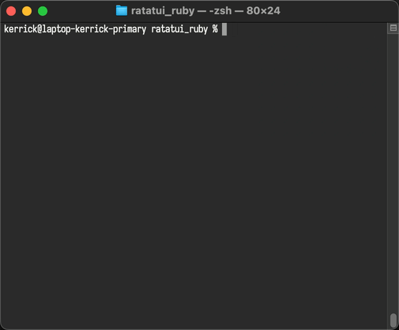

<!--
  SPDX-FileCopyrightText: 2026 Kerrick Long <me@kerricklong.com>
  SPDX-License-Identifier: CC-BY-SA-4.0
-->

# CLI Rich Moments Example

[](app.rb)

Demonstrates inline viewport usage for CLI tools that need brief moments of rich interactivity without full-screen commitment.

## Context

CLI applications often need moments of richness—a spinner while connecting, a quick menu selection, or a brief editor. But committing to a full-screen TUI feels wrong when 90% of the app is traditional CLI output.

## Problem

Standard full-screen TUIs (alternate screen) erase themselves on exit. Your carefully formatted CLI output disappears. Users lose their history. The terminal scrollback becomes useless.

## Solution

This example shows how **inline viewports** solve this problem. Inline regions persist in terminal scrollback after exit. You can mix inline and fullscreen viewports across multiple `RatatuiRuby.run` calls in a single application flow.

## Flow

The application demonstrates four distinct phases:

1. **1-line inline**: Braille spinner (⠋ ⠙ ⠹ etc.) + "Connecting..." status
2. **5-line inline**: Radio button menu with up/down/enter navigation  
3. **Fullscreen**: Configuration editor showing legitimate use of alternate screen
4. **1-line inline**: Braille spinner + "Saving..." confirmation

After exit, all inline outputs remain visible in terminal history. The fullscreen portion disappears cleanly.

## Running

<!-- SPDX-SnippetBegin -->
<!--
  SPDX-FileCopyrightText: 2026 Kerrick Long
  SPDX-License-Identifier: MIT-0
-->
```bash
cd examples/app_cli_rich_moments
ruby app.rb
```
<!-- SPDX-SnippetEnd -->

## Architecture

Each phase is a separate `RatatuiRuby.run` block with its own viewport configuration. State (like menu selection) must be passed between phases via instance variables.

**Spinner phases**:
- Use `viewport: :inline, height: 1`
- Animate Braille frames with short delays
- No input handling needed

**Menu phase**:
- Uses `viewport: :inline, height: 5`  
- Handles up/down arrow keys for selection
- Returns selected choice for next phase

**Editor phase**:
- Uses default fullscreen viewport
- Demonstrates when alternate screen is appropriate
- Full 80×24 available

## Key Concepts

- **Viewport independence**: Each `run` block can use different viewport modes
- **Scrollback persistence**: Inline content remains after exit
- **State management**: Pass data between phases via instance variables
- **Appropriate contexts**: Inline for brief moments, fullscreen for sustained interaction

## Learning Outcomes

After studying this example, you'll understand:

- When to use inline vs fullscreen viewports
- How to mix viewport modes in a single application
- Why inline viewports improve CLI UX for transient interactions
- How to manage state across multiple `run` blocks
