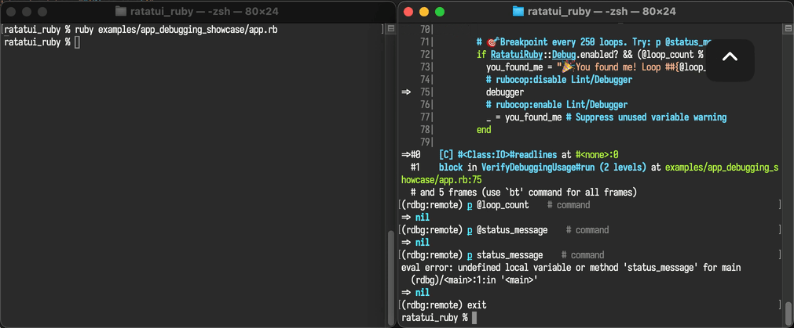

<!--
  SPDX-FileCopyrightText: 2026 Kerrick Long <me@kerricklong.com>
  SPDX-License-Identifier: CC-BY-SA-4.0
-->

# Debugging Showcase

[](app.rb)

Interactive demonstration of RatatuiRuby's debugging features.

For comprehensive documentation, see the [Debugging Guide](../../doc/concepts/debugging.md).

## What This Example Does

This app lets you trigger each debugging feature with a hotkey. Test your setup before encountering a real bug.

| Key | Action |
|-----|--------|
| `d` | Enable `debug_mode!` programmatically |
| `p` | Trigger a Rust panic |
| `t` | Trigger a Rust `TypeError` |
| `b` | Refresh debug status |
| `q` | Quit |

## Library Features Showcased

Reading this code will teach you how to:

*   **Enable Remote Debugging**: Call `RatatuiRuby.debug_mode!` and receive the socket path
*   **Detect Debug State**: Query `Debug.enabled?`, `Debug.rust_backtrace_enabled?`, and `Debug.remote_debugging_mode`
*   **Trigger Test Panics**: Use `Debug.test_panic!` to verify Rust backtrace visibility
*   **See Improved Error Messages**: Bypass DWIM coercion to see `TypeError` messages with value context

**Note:** Rust backtraces only appear for panics (`[p]`). Exceptions (`[t]`) show Ruby backtraces with improved error messages from Rust.

## Environment Variables

The example behaves differently depending on which environment variables you set.

### No Environment Variables

<!-- SPDX-SnippetBegin -->
<!--
  SPDX-FileCopyrightText: 2026 Kerrick Long
  SPDX-License-Identifier: MIT-0
-->
```bash
ruby examples/app_debugging_showcase/app.rb
```
<!-- SPDX-SnippetEnd -->

The TUI starts normally. Rust backtraces are disabled. Press `[d]` to enable remote debugging mid-session.

### `RUST_BACKTRACE=1`

<!-- SPDX-SnippetBegin -->
<!--
  SPDX-FileCopyrightText: 2026 Kerrick Long
  SPDX-License-Identifier: MIT-0
-->
```bash
RUST_BACKTRACE=1 ruby examples/app_debugging_showcase/app.rb
```
<!-- SPDX-SnippetEnd -->

Enables Rust backtraces. Press `[p]` to see the full Rust stack trace with file names and line numbers.

### `RR_DEBUG=1`

<!-- SPDX-SnippetBegin -->
<!--
  SPDX-FileCopyrightText: 2026 Kerrick Long
  SPDX-License-Identifier: MIT-0
-->
```bash
RR_DEBUG=1 ruby examples/app_debugging_showcase/app.rb
```
<!-- SPDX-SnippetEnd -->

Full debug mode at startup. The debugger opens a socket and **waits for a connection** before the TUI starts. You'll see the socket path printed before the app runs.

In another terminal:

<!-- SPDX-SnippetBegin -->
<!--
  SPDX-FileCopyrightText: 2026 Kerrick Long
  SPDX-License-Identifier: MIT-0
-->
```bash
rdbg --attach
```
<!-- SPDX-SnippetEnd -->

When you attach, you'll see "Stop by SIGURG" — that's normal! SIGURG is how the debug gem signals the app to pause. Type `continue` to resume.

This uses the [ruby/debug](https://github.com/ruby/debug?tab=readme-ov-file#readme) gem for remote debugging.

### When to Use Which

`RR_DEBUG=1` includes Rust backtraces automatically (it calls `enable_rust_backtrace!` internally).

Use `RUST_BACKTRACE=1` alone when you want backtraces but **don't** want the debugger to stop and wait for a connection at startup.

## What Problems Does This Solve?

### "Is my Rust backtrace setup working?"

Press `[p]`. If you see a stack trace with file names and line numbers, you're good. If not, you need `RUST_BACKTRACE=1`.

### "How do I attach a debugger to a TUI?"

TUIs run in raw mode — you can't type into a REPL. Press `[d]` to enable remote debugging. The socket path appears in the UI. Run `rdbg --attach` from another terminal.

### "What does a Rust TypeError look like?"

Press `[t]`. The error message shows the expected type and the actual value you passed (e.g., `expected array for rows, got 42`). Note: This shows Ruby's backtrace — only panics (`[p]`) show Rust backtraces.

[Read the source code →](app.rb)
