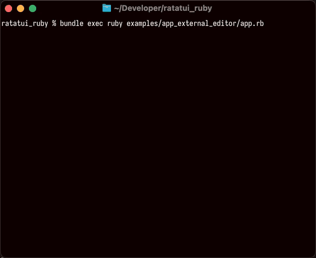

<!--
  SPDX-FileCopyrightText: 2026 Kerrick Long <me@kerricklong.com>
  SPDX-License-Identifier: CC-BY-SA-4.0
-->

# External Editor Example

[](app.rb)

Demonstrates temporarily exiting the TUI to invoke an external editor, then seamlessly re-entering—like editing a commit message in lazygit or tig.

Most applications use `RatatuiRuby.run { }` which handles terminal setup and teardown automatically. But some workflows require **repeatedly leaving and re-entering raw mode** during a single session. This example shows the low-level lifecycle API that makes this possible.

## Features Demonstrated

- **Full Lifecycle Control**: Using `init_terminal` and `restore_terminal` directly instead of the `run` block.
- **External Process Invocation**: Safely restoring the terminal before spawning an interactive subprocess.
- **Session Re-entry**: Returning to the TUI after the external process exits, with state preserved.
- **Split-Pane Layout**: Dynamically splitting the display when scratch content exists.
- **Focus-Aware Scrolling**: Keyboard scrolling affects the focused pane; mouse scroll affects the hovered pane.
- **Wrapped Line Clamping**: Scroll limits based on wrapped (not raw) line count using `paragraph.line_count`.
- **Mouse Hit Testing**: Using `area.contains?(x, y)` to detect which pane is hovered.

## Hotkeys

| Key | Action |
|-----|--------|
| `↑`/`↓` or `j`/`k` | Scroll one line |
| `PgUp`/`PgDn` | Scroll one page |
| `Home`/`End` | Jump to top/bottom |
| Mouse wheel | Scroll hovered pane |
| `Tab` or `←`/`→` or `h`/`l` | Switch focus between panes |
| `e` | Edit this README.md in `$EDITOR` |
| `s` | Edit scratch file; saved content appears in split pane |
| `q` | Quit |

## Usage

<!-- SPDX-SnippetBegin -->
<!--
  SPDX-FileCopyrightText: 2026 Kerrick Long
  SPDX-License-Identifier: MIT-0
-->
```bash
ruby examples/app_external_editor/app.rb
```
<!-- SPDX-SnippetEnd -->

Press `e` to edit this README. Press `s` to open a scratch file—when you save content, it appears beside the README in a split view.

## Learning Outcomes

Use this example if you need to...

- Implement commit message editing (like lazygit, tig, or git rebase -i).
- Spawn an external config editor from a TUI settings menu.
- Build a workflow that alternates between TUI and external tools.
- Create a split-pane layout with focus-aware scrolling.
- Calculate wrapped line counts for proper scroll clamping.
- Implement mouse hit testing for pane-specific interactions.

[Read the source code →](app.rb)
