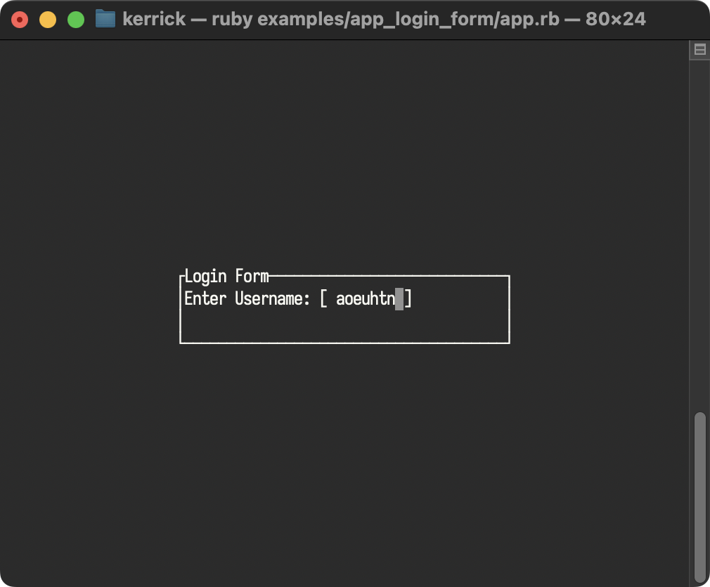

<!--
SPDX-FileCopyrightText: 2025 Kerrick Long <me@kerricklong.com>
SPDX-License-Identifier: CC-BY-SA-4.0
-->

# Login Form Example

[](app.rb)

Demonstrates how to create a modal overlay for user input.

Many applications need to block interaction with the main UI while collecting specific information, like a login prompt or confirmation dialog. Managing the z-index and input focus for these overlays can be tricky.

This example solves this by using the `Overlay` widget to stack a centered popup on top of a base layer, conditionally rendering the popup based on state.

## Features Demonstrated

- **Overlays:** Stacking widgets on top of each other using `tui.overlay`.
- **Centering:** Positioning a widget in the center of the screen using `tui.center`.
- **State Management:** Switching between "Base" and "Popup" views.
- **Input Handling:** Capturing text input and handling specific keys (Enter, Esc) to trigger state changes.
- **Cursor Positioning:** Manually calculating cursor position within a `Paragraph`.

## Hotkeys

### Form Mode
- **Text Input**: Type to enter username (supports all characters including 'q').
- **Backspace**: Deletes the last character.
- **Enter**: Submits the form and opens the success popup.
- **Esc**: Quits the application.
- **Ctrl+C**: Quits the application.

### Popup Mode
- **q**: Closes the popup and quits the application.
- **Ctrl+C**: Quits the application.

## Usage

```bash
ruby examples/app_login_form/app.rb
```

## Learning Outcomes

Use this example if you need to...

- Create a modal dialog or popup.
- Center a widget on the screen (vertically and horizontally).
- Implement a simple text input field with cursor management.
- layer widgets using the `Overlay` widget.

[Read the source code →](app.rb)
