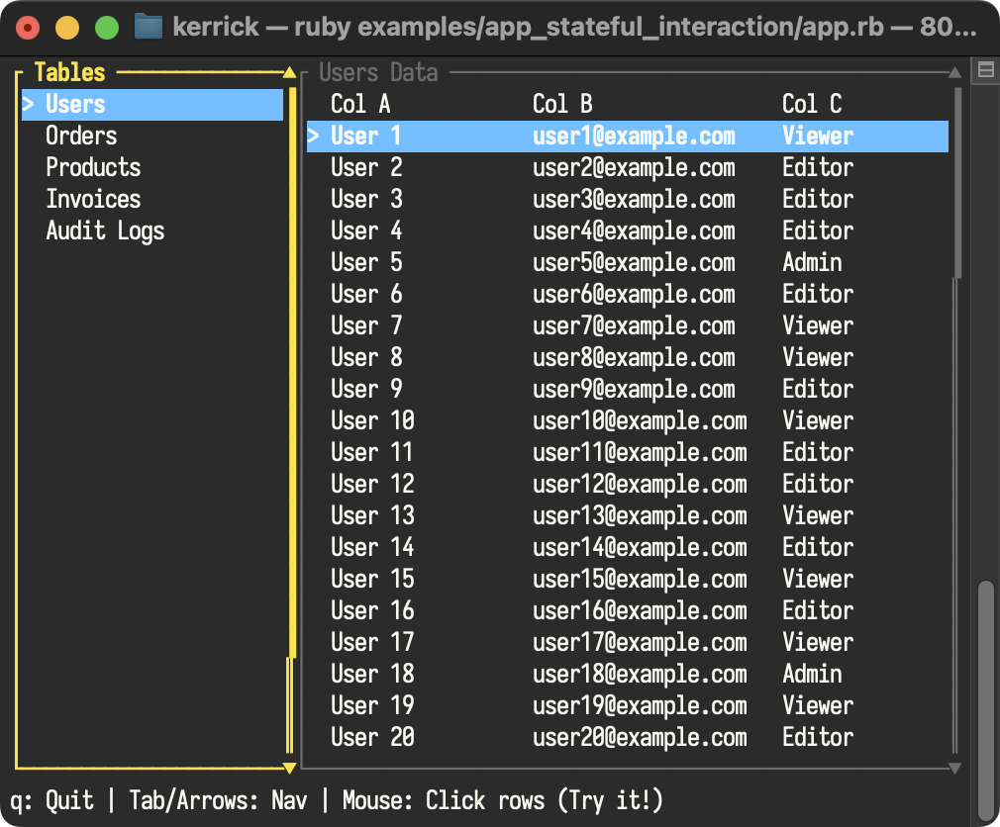

<!--
SPDX-FileCopyrightText: 2025 Kerrick Long <me@kerricklong.com>
SPDX-License-Identifier: CC-BY-SA-4.0
-->

# Stateful Interaction Example

This example demonstrates High-Fidelity Interaction using **Stateful Widget Rendering**.

It showcases a "Database Viewer" layout where:
1.  **Selection Persistence:** `ListState` and `TableState` objects persist across frames, maintaining selection without manual index tracking variables.
2.  **Offset Read-back:** The application reads `state.offset` *after* rendering to know exactly which items were visible on screen.
3.  **Mouse Interaction:** Using the read-back offset, we can calculate exactly which row was clicked, even when the specific item wasn't drawn at that absolute Y position due to scrolling.

## Key Concept: The "Read-back" Loop

Standard immediate-mode interaction often requires you to re-calculate layout logic to determine what was clicked.

In `ratatui_ruby`'s Stateful Rendering:
1.  **Update**: You modify `state` (e.g., `state.select(1)`).
2.  **Render**: You pass `state` to `render_stateful_widget`. Ratatui's Rust backend calculates layout and **updates** `state.offset` in-place if scrolling happened.
3.  **Interact**: On the next event loop, you use `state.offset` to correctly map mouse coordinates to data indices.

## Hotkeys

| Key | Action |
| --- | --- |
| `↑` / `↓` | Scroll the active pane |
| `Tab` / `←` / `→` | Switch active pane (List vs Table) |
| `Mouse Click` | Select the clicked row (Works with scrolling!) |
| `q` | Quit |
