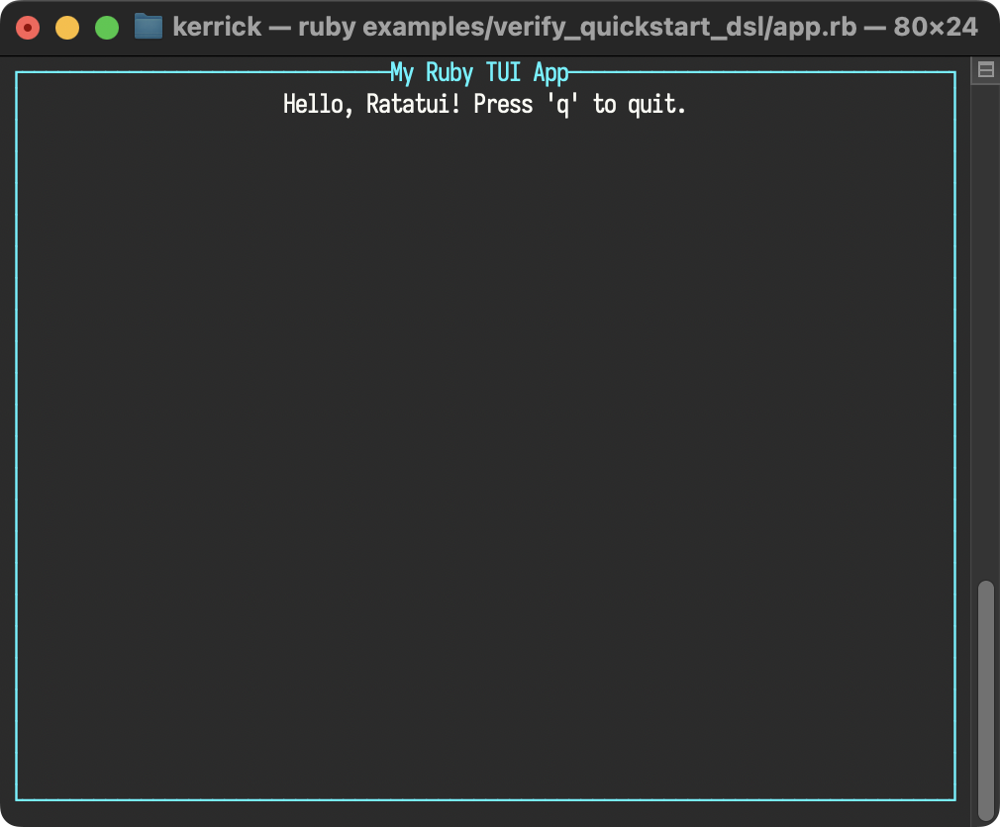

<!--
SPDX-FileCopyrightText: 2026 Kerrick Long <me@kerricklong.com>
SPDX-License-Identifier: CC-BY-SA-4.0
-->

# Quickstart DSL Verification

Verifies the "Simplified API" tutorial in the [Quickstart](../../doc/getting_started/quickstart.md#simplified-api).

This example exists as a documentation regression test. It ensures the recommended TUI facade and managed lifecycle workflow remains functional.

## Usage

<!-- SYNC:START:app.rb:main -->
```ruby
# 1. Initialize the terminal, start the run loop, and ensure the terminal is restored.
RatatuiRuby.run do |tui|
  loop do
    # 2. Create your UI with methods instead of classes.
    view = tui.paragraph(
      text: "Hello, Ratatui! Press 'q' to quit.",
      alignment: :center,
      block: tui.block(
        title: "My Ruby TUI App",
        title_alignment: :center,
        borders: [:all],
        border_color: "cyan",
        style: { fg: "white" }
      )
    )

    # 3. Use RatatuiRuby methods, too.
    tui.draw do |frame|
      frame.render_widget(view, frame.area)
    end

    # 4. Poll for events with pattern matching
    case tui.poll_event
    in { type: :key, code: "q" }
      break
    else
      # Ignore other events
    end
  end
end
```
<!-- SYNC:END -->

[](../../doc/getting_started/quickstart.md#simplified-api)
