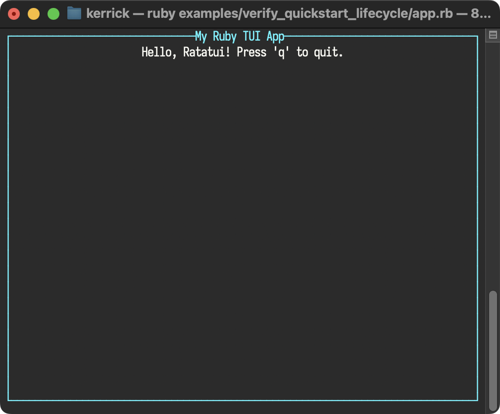

<!--
SPDX-FileCopyrightText: 2026 Kerrick Long <me@kerricklong.com>
SPDX-License-Identifier: CC-BY-SA-4.0
-->

# Quickstart Lifecycle Verification

Verifies the "Basic Application" tutorial in the [Quickstart](../../doc/getting_started/quickstart.md#basic-application).

This example exists as a documentation regression test. It ensures the core lifecycle example presented to new users remains functional.

## Usage

<!-- SPDX-SnippetBegin -->
<!--
  SPDX-FileCopyrightText: 2026 Kerrick Long
  SPDX-License-Identifier: MIT-0
-->
<!-- SYNC:START:app.rb:main -->
```ruby
# 1. Initialize the terminal
RatatuiRuby.init_terminal

begin
  # The Main Loop
  loop do
    # 2. Create your UI (Immediate Mode)
    # We define a Paragraph widget inside a Block with a title and borders.
    view = RatatuiRuby::Widgets::Paragraph.new(
      text: "Hello, Ratatui! Press 'q' to quit.",
      alignment: :center,
      block: RatatuiRuby::Widgets::Block.new(
        title: "My Ruby TUI App",
        title_alignment: :center,
        borders: [:all],
        border_color: "cyan",
        style: { fg: "white" }
      )
    )

    # 3. Draw the UI
    RatatuiRuby.draw do |frame|
      frame.render_widget(view, frame.area)
    end

    # 4. Poll for events
    case RatatuiRuby.poll_event
    in { type: :key, code: "q" } | { type: :key, code: "c", modifiers: ["ctrl"] }
      break
    else
      nil
    end

    # 5. Guard against accidental output (optional but recommended)
    # Wrap any code that might puts/warn to prevent screen corruption.
    RatatuiRuby.guard_io do
      # SomeChattyGem.do_something
    end
  end
ensure
  # 6. Restore the terminal to its original state
  RatatuiRuby.restore_terminal
end
```
<!-- SYNC:END -->
<!-- SPDX-SnippetEnd -->

[](../../doc/getting_started/quickstart.md#basic-application)
