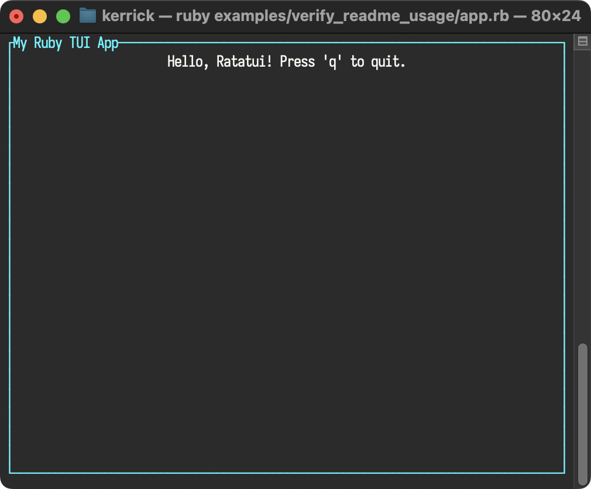

<!--
SPDX-FileCopyrightText: 2026 Kerrick Long <me@kerricklong.com>
SPDX-License-Identifier: CC-BY-SA-4.0
-->

# README Usage Verification

Verifies the primary usage example in the project [README](../../README.md#usage).

This example exists as a documentation regression test. It ensures that the very first code snippet a user sees actually works.

## Usage

<!-- SYNC:START:app.rb:main -->
```ruby
RatatuiRuby.run do |tui|
  loop do
    tui.draw do |frame|
      frame.render_widget(
        tui.paragraph(
          text: "Hello, Ratatui! Press 'q' to quit.",
          alignment: :center,
          block: tui.block(
            title: "My Ruby TUI App",
            borders: [:all],
            border_color: "cyan"
          )
        ),
        frame.area
      )
    end
    event = tui.poll_event
    break if event == "q" || event == :ctrl_c
  end
end
```
<!-- SYNC:END -->


