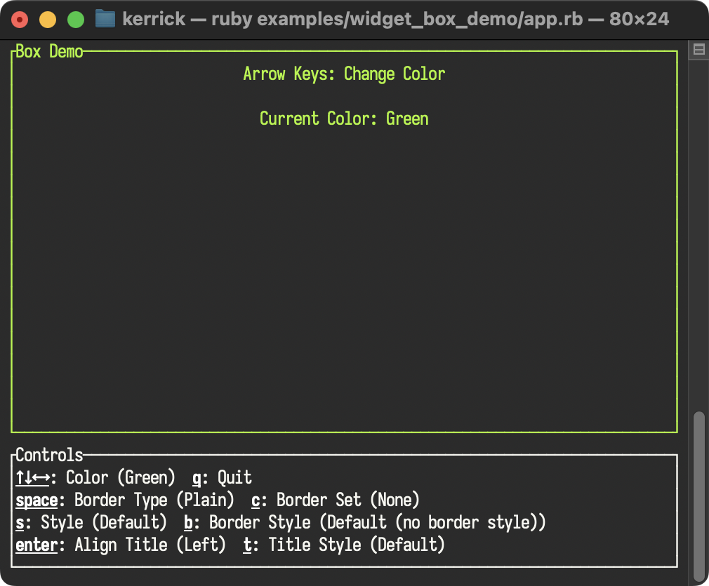

<!--
SPDX-FileCopyrightText: 2026 Kerrick Long <me@kerricklong.com>
SPDX-License-Identifier: CC-BY-SA-4.0
-->

# Block (Box) Example

[](app.rb)

Demonstrates visual container attributes with interactive cycling.

Widgets often float in a void. Without boundaries, interfaces become a chaotic mess of text. `Block` (often called a Box) provides the structure and visual hierarchy needed to organize information.

## Features Demonstrated

- **Border Types**: Native styles like `:plain`, `:rounded`, `:double`, `:thick`.
- **Custom Borders**: defining completely custom character sets (e.g. using numbers or letters for borders).
- **Styling**: Independent control over border color, background style, and title style.
- **Positioning**: Placing titles on the `:top` or `:bottom` border (`position`).
- **Alignment**: Aligning titles to `:left`, `:center`, or `:right` (`alignment`).

## Hotkeys

- **Arrow Keys**: Change Border/Content Color
- **Space**: Cycle Border Type (`border_type`)
- **c**: Cycle Custom Border Set (`border_set`)
- **Enter**: Cycle Title Alignment (`title_alignment`)
- **s**: Cycle Content Style (`style`)
- **t**: Cycle Title Style (`title_style`)
- **b**: Cycle Border Style (`border_style`)
- **q**: Quit

## Usage

```bash
ruby examples/widget_box/app.rb
```

## Learning Outcomes

Use this example if you need to...

- Group related widgets together.
- Create distinct "panels" or "cards" in your UI.
- Style borders to indicate state (e.g., Red border for error state).
- Understand the difference between `style` (content) and `border_style` (frame).

[Read the source code →](app.rb)
