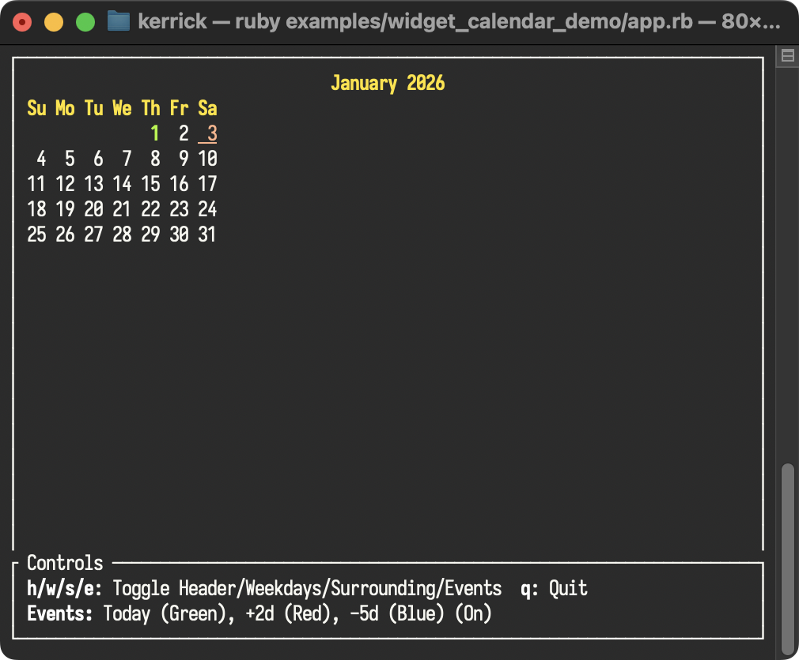

<!--
SPDX-FileCopyrightText: 2026 Kerrick Long <me@kerricklong.com>
SPDX-License-Identifier: CC-BY-SA-4.0
-->

# Calendar Widget Example

[](app.rb)

Demonstrates a monthly calendar with customizable headers and event highlighting.

Rendering dates in a grid involves complex calculations for leap years and weekday offsets. This widget handles that logic, letting you focus on displaying dates.

## Features Demonstrated

- **Headers**: Toggling the Month name and Weekday labels.
- **Surrounding Days**: displaying (or hiding/dimming) days from the previous and next months to fill the grid.
- **Event Styling**: applying specific styles to individual `Time` or `Date` objects to highlight events.

## Hotkeys

- **h**: Toggle Month Header (`show_month_header`)
- **w**: Toggle Weekday Labels (`show_weekdays_header`)
- **s**: Toggle Surrounding Days (`show_surrounding`)
- **e**: Toggle Example Events (`events`)
- **q**: Quit

## Usage

```bash
ruby examples/widget_calendar/app.rb
```

## Learning Outcomes

Use this example if you need to...

- Display a date picker.
- Show a schedule or timeline view.
- Highlight specific dates (deadlines, holidays) on a calendar grid.

[Read the source code →](app.rb)
