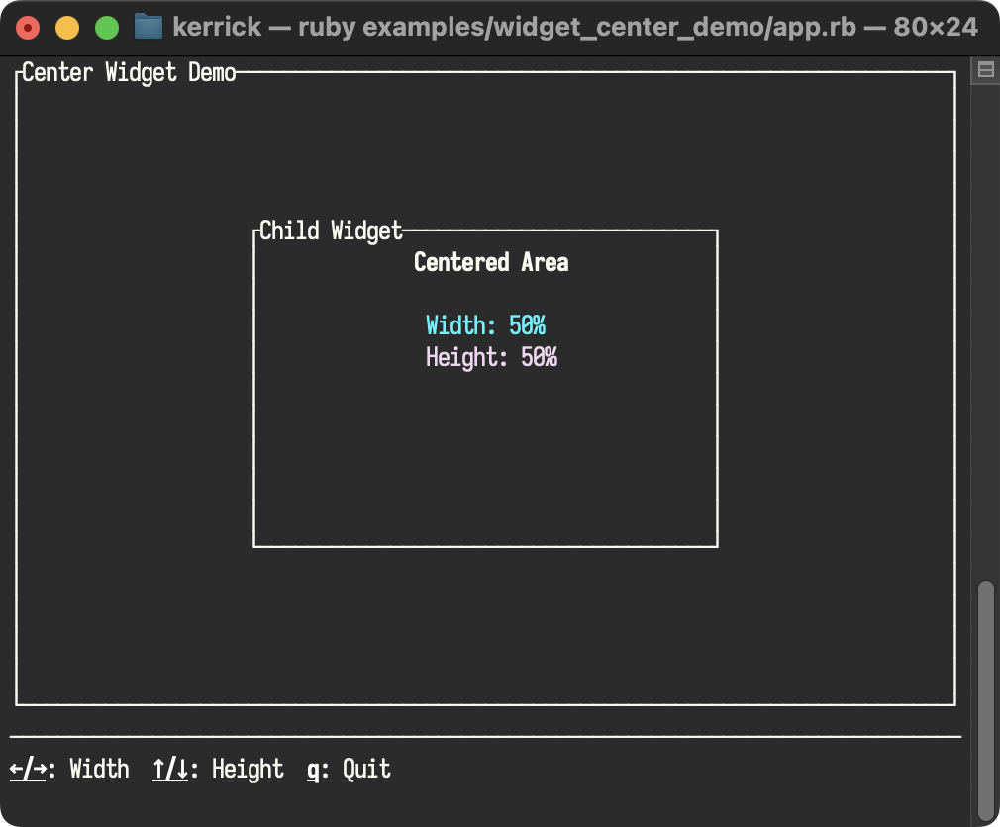

# Center Example

<!--
SPDX-FileCopyrightText: 2025 Kerrick Long <me@kerricklong.com>
SPDX-License-Identifier: CC-BY-SA-4.0
-->

This example demonstrates the `Center` widget, which positions a child widget in the center of the available area.

## Key Concepts

- **Centering**: The widget automatically calculates the necessary padding to center its child.
- **Sizing**: You can control the size of the centered area using `width_percent` and `height_percent`.
- **Composition**: The `Center` widget wraps another widget (the child), making it easy to compose layouts.

## Controls

| Key | Action |
| --- | --- |
| `←` / `→` | Decrease / Increase width percentage |
| `↑` / `↓` | Increase / Decrease height percentage |
| `q` | Quit |

## Screenshot
## Source Code

- [app.rb](app.rb)
