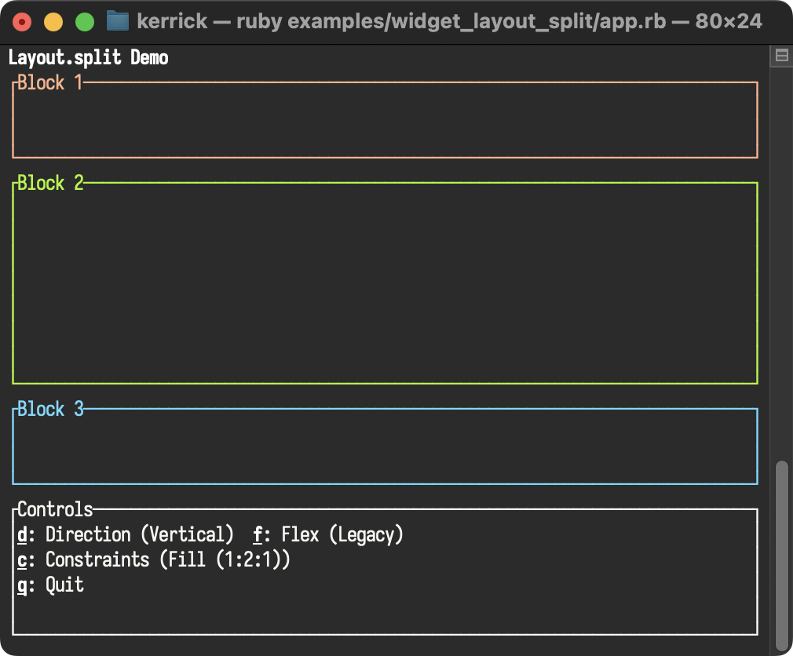

<!--
SPDX-FileCopyrightText: 2026 Kerrick Long <me@kerricklong.com>
SPDX-License-Identifier: CC-BY-SA-4.0
-->

# Layout (Split, Grid) Example

[](app.rb)

Demonstrates dynamic geometry management with constraints and flex modes.

Terminal screens vary in size. Hardcoded layouts break. `Layout.split` manages space dynamically, ensuring your interface adapts to any window dimension.

## Features Demonstrated

- **Constraints**:
    - `Fill(n)`: Takes available space proportional to `n`.
    - `Length(n)`: Fixed number of cells.
    - `Percentage(n)`: Percentage of the parent area.
    - `Min(n)`: At least `n` cells.
    - `Ratio(x, y)`: `x/y` of the parent area.
- **Flex Modes**: Controlling how extra space is distributed (`Start`, `End`, `Center`, `SpaceBetween`, etc.).
- **Direction**: Splitting Vertically vs Horizontally.

## Hotkeys

- **d**: Toggle Direction (`direction`)
- **f**: Cycle Flex Mode (`flex`)
- **c**: Cycle Constraint Set (`constraints`)
- **q**: Quit

## Usage

```bash
ruby examples/widget_layout_split/app.rb
```

## Learning Outcomes

Use this example if you need to...

- Build responsive dashboards.
- Create 3-column layouts where the middle content fills remaining space.
- Center a modal dialog on the screen.
- Distribute buttons evenly across a control bar.

[Read the source code →](app.rb)
