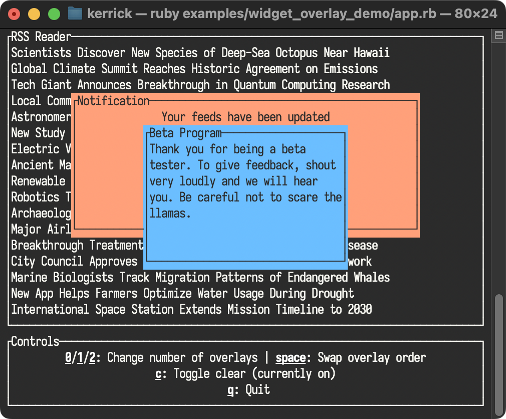

<!--
  SPDX-FileCopyrightText: 2025 Kerrick Long <me@kerricklong.com>
  SPDX-License-Identifier: CC-BY-SA-4.0
-->
# Overlay Widget Demo

[](app.rb)

This example demonstrates the `Overlay` composition pattern for layering widgets with depth. Modals, notifications, and floating panels all require stacking widgets on top of each other.

## Key Concepts

- **Layer Composition:** Rendering widgets in order creates visual depth — later renders appear "on top."
- **Clear Widget:** Using `tui.clear` before rendering a modal erases the background, preventing content bleed-through.
- **Dynamic Layer Control:** Toggle the number of visible overlay layers at runtime.
- **Layer Ordering:** Swap which overlay appears in front to demonstrate z-ordering.

## Hotkeys

- `0`/`1`/`2`: Set number of visible overlay layers
- `space`: Swap overlay order (which modal is on top)
- `c`: Toggle Clear widget (on/off)
- `q`: Quit

## Usage

```bash
ruby examples/widget_overlay_demo/app.rb
```

## Learning Outcomes

Use this example if you need to...
- Build modal dialogs or confirmation popups.
- Layer notifications over existing content.
- Understand the Clear widget's role in opaque overlays.
