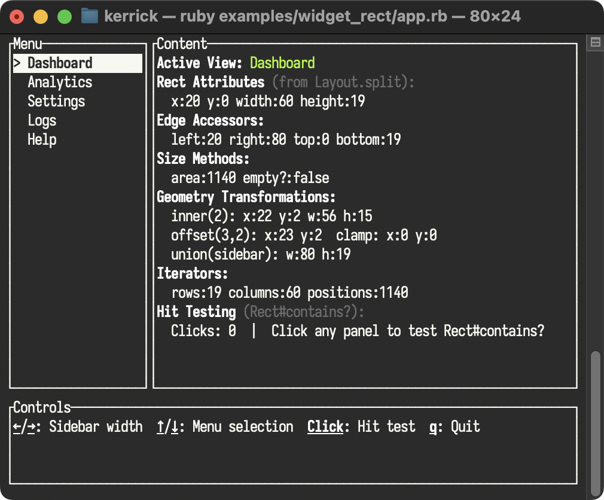

<!--
SPDX-FileCopyrightText: 2026 Kerrick Long <me@kerricklong.com>
SPDX-License-Identifier: CC-BY-SA-4.0
-->

# Rect (Area, Rectangle) Example

[](app.rb)

Demonstrates the Rect geometry primitive and hit-testing patterns.

TUI layouts are composed of rectangles. Understanding how to manipulate `Rect` objects, reuse them from the layout phase, and use them for mouse interaction is critical for building interactive apps.

## Features Demonstrated

- **Rect Attributes**: Investigating x, y, width, and height.
- **Edge Accessors**: Using `left`, `right`, `top`, `bottom` instead of manual math.
- **Size Methods**: Checking `area` and `empty?` for guard clauses.
- **Geometry Transformations**: Computing `inner`, `offset`, `union`, and `clamp`.
- **Iterators**: Traversing `rows`, `columns`, and `positions`.
- **Cached Layout Pattern**: Computing constraints in the render loop and reusing the resulting `Rect`s in the event loop for logic.
- **Hit Testing**: Using `Rect#contains?(x, y)` to determine if a mouse click happened inside a specific panel.

## Hotkeys

- **Arrows (←/→)**: Expand/Shrink Sidebar Width (Layout Constraint)
- **Arrows (↑/↓)**: Navigate Menu Selection (`selected_index`)
- **Mouse Click**: Click anywhere to see which Rect detects the hit (`contains?`)
- **q**: Quit

## Usage

<!-- SPDX-SnippetBegin -->
<!--
  SPDX-FileCopyrightText: 2026 Kerrick Long
  SPDX-License-Identifier: MIT-0
-->
```bash
ruby examples/widget_rect/app.rb
```
<!-- SPDX-SnippetEnd -->

## Learning Outcomes

Use this example if you need to...

- Handle mouse clicks on specific buttons or areas.
- Create resizable panes (like a split pane in an IDE).
- Debug layout issues by inspecting Rect coordinates.
- Compute inner padding, bounding boxes, or clamped popups.
- Iterate over rows, columns, or individual positions within a region.

[Read the source code →](app.rb)
