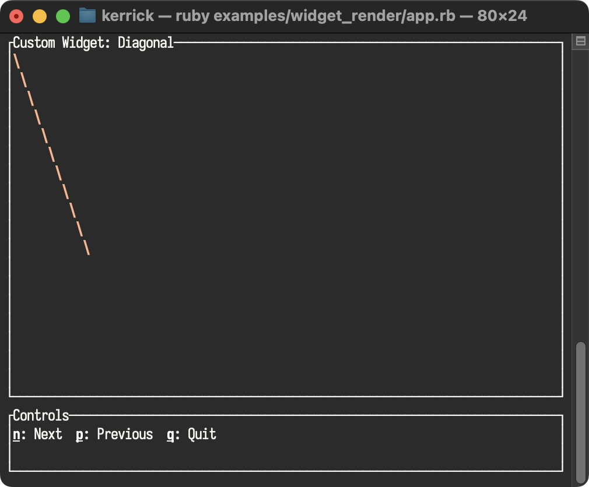

<!--
SPDX-FileCopyrightText: 2026 Kerrick Long <me@kerricklong.com>
SPDX-License-Identifier: CC-BY-SA-4.0
-->

# Render (Custom Widget) Example

[](app.rb)

Demonstrates how to build Custom Widgets using absolute coordinates.

Sometimes standard widgets aren't enough. You need to draw custom shapes, games, or graphs. This example shows how to implement the `render(area)` contract to draw anything you want while respecting layout boundaries.

## Features Demonstrated

- **Custom Widget Contract**: Implementing a class with `render(area)`.
- **Coordinate Offsets**: Creating drawing logic that works regardless of where the widget is placed on screen (using `area.x + offset`).
- **Composability**: Wrapping custom widgets in standard `Block`s with borders.

## Hotkeys

- **n**: Next Widget (Diagonal -> Checkerboard -> Border)
- **p**: Previous Widget
- **q**: Quit

## Usage

```bash
ruby examples/widget_render/app.rb
```

## Learning Outcomes

Use this example if you need to...
- Build a game (Snake, Tetris) inside the terminal.
- Create a specialized visualization (Network topology graph).
- Draw custom UI elements not provided by the library.