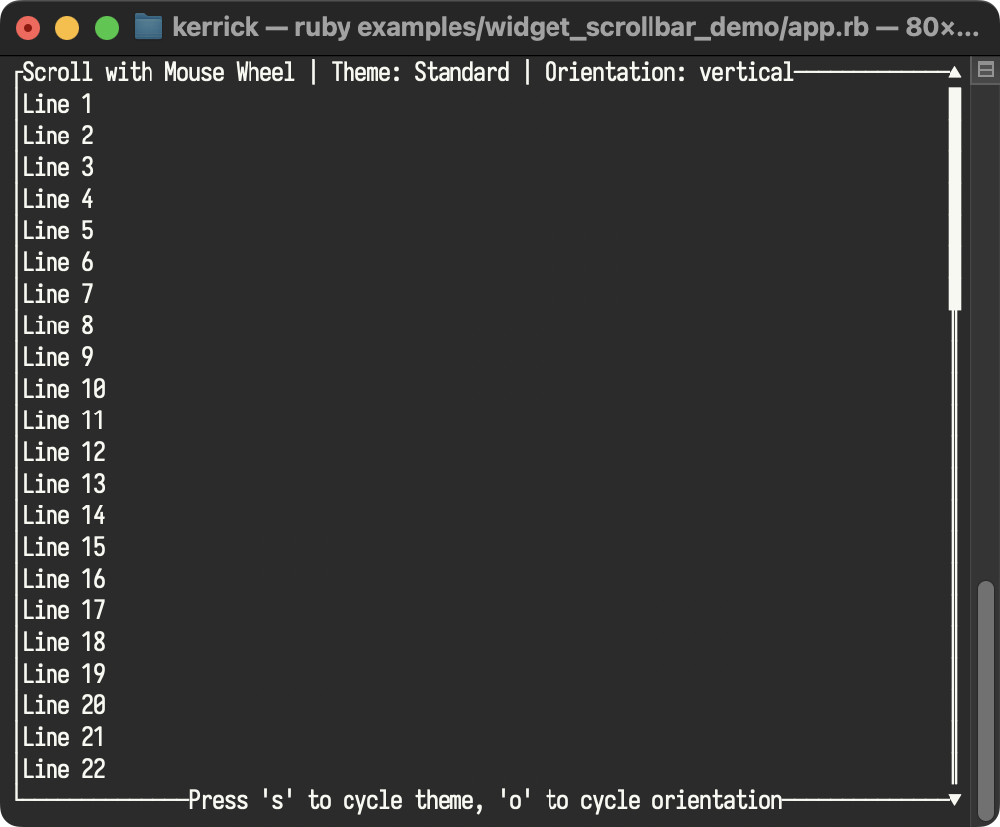

<!--
SPDX-FileCopyrightText: 2026 Kerrick Long <me@kerricklong.com>
SPDX-License-Identifier: CC-BY-SA-4.0
-->

# Scrollbar (Scroll) Example

[](app.rb)

Demonstrates explicit scrollbars for navigation feedback.

Content overflows. Users get lost in long lists. Scrollbars provide essential spatial awareness ("How far down am I?") and navigation controls.

## Features Demonstrated

- **Orientation**: Vertical, Horizontal, and variation modes (Right/Left, Top/Bottom).
- **Styling**: Custom characters for Track, Thumb, and arrows.
- **State Integration**: Linking the scrollbar `position` to the content view state.

## Hotkeys

- **Mouse Wheel**: Scroll content (`position`)
- **s**: Cycle Scrollbar Theme (Standard, Rounded, ASCII, Minimal)
- **o**: Cycle Orientation (`orientation`)
- **q**: Quit

## Usage

```bash
ruby examples/widget_scrollbar/app.rb
```

## Learning Outcomes

Use this example if you need to...

- Add visual scroll indicators to Lists or Tables.
- Implement specialized inputs like sliders or volume controls.

[Read the source code →](app.rb)
