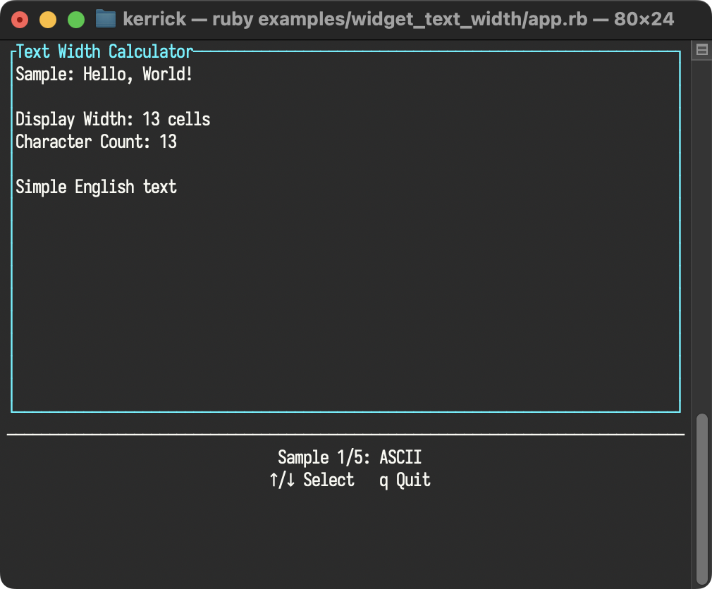

<!--
SPDX-FileCopyrightText: 2026 Kerrick Long <me@kerricklong.com>
SPDX-License-Identifier: CC-BY-SA-4.0
-->

# Text Width Calculator

[](app.rb)

Demonstrates string width calculation in a terminal environment.

Not all characters are created equal. In a TUI, "Width" means cell count, not string length. Emoji (`👍`) take 2 cells. Chinese characters (`你`) take 2 cells. The `tui.text_width` helper tells you the visual width of a string.

## Features Demonstrated

- **Unicode Width**: Rendering ASCII (1 cell), CJK (2 cells), and Emoji (2 cells).
- **Calculation**: Comparing `string.length` vs `tui.text_width(string)`.

## Hotkeys

- **Up/Down (↑/↓)**: Cycle Text Sample
- **q**: Quit

## Usage

```bash
ruby examples/widget_text_width/app.rb
```

## Learning Outcomes

Use this example if you need to...
- Align text correctly in columns.
- Truncate strings that are too long for a widget.
- Build your own custom layout engine.